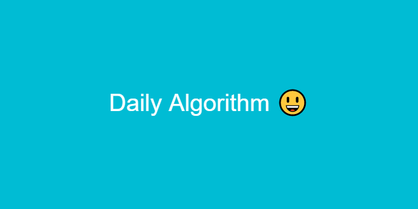

# 모의고사

[문제 링크](https://programmers.co.kr/learn/courses/30/lessons/42840)

## 해결방법

1. 문제의 답 리스트와 학생의 답을 비교하여 점수를 측정
2. `sort`를 이용해 최고 점수를 뽑고
3. `filter`를 이용해 최고 점수가 아닌 학생들을 제거하고
4. `map`을 이용해 id들만 뽑아낸다

## 소스코드

```ts
function solution(answers: number[]): number[] {
  const students: { id: number; score: number; answers: number[] }[] = [
    { id: 1, score: 0, answers: [1, 2, 3, 4, 5] },
    { id: 2, score: 0, answers: [2, 1, 2, 3, 2, 4, 2, 5] },
    { id: 3, score: 0, answers: [3, 3, 1, 1, 2, 2, 4, 4, 5, 5] },
  ]

  answers.forEach((a, idx) => {
    students.forEach(s => {
      s.score = s.answers[idx % s.answers.length] === a ? s.score + 1 : s.score
    })
  })

  const result = students
    .sort((a, b) => b.score - a.score)
    .filter((s, _, arr) => s.score === arr[0].score)
    .map(s => s.id)

  return result
}
```
