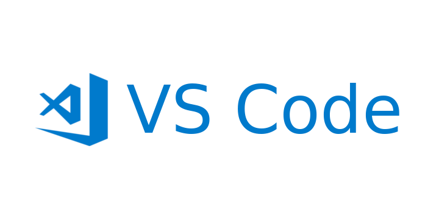

VS Code 설치 이후 prettier 세팅 방법을 기술합니다.

### Prettier 설치

`Extention(Ctrl+Shift+x)`에서 `Prettier`를 설치해줍니다.

### Settings

`Settings(Ctrl+,)`에서 Default Formatter를 변경합니다.

`Settings(Ctrl+,)`에서 Format on Save를 체크하면 저장 시에 Prettier의 설정에 맞춰 자동 포맷팅이 이뤄집니다.  

