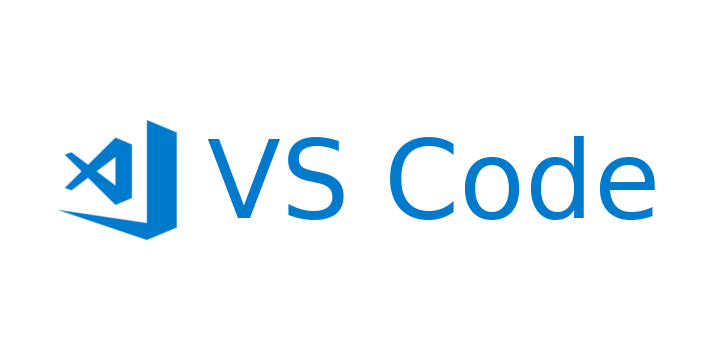

# 3줄 요약

> VS Code로 TS를 디버깅하는데 127 Error가 발생한다면
> `.vscode/tasks.json`에 `tsc:build` task를 생성하고
> `.vscode/launce.json` 파일을 변경하면 해결됩니다.

# 개요

Javascript와 NodeJS를 이용하던 프로젝트를 성공적으로 Typescript로 마이그레이션 하였습니다.

모든 소스를 TS로 변환한 이후 Typescript의 강력한 code Intellisense에 콧노래를 부르던 중 난관에 부딛혔습니다.

VS Code를 이용한 디버깅 환경을 구축하던 중 아래와 같은 에러를 맞이했습니다.


```
The PreLaunchTask 'tsc: build - tsconfig.json' terminated with exit code 127.
```

JS->TS로 바꾸던 과정에서 맞이한 다른 어려움들과 같이 문서를 보면 금새 처리할 줄 알았지만...

하루를 꼬박 쏟아부었습니다.


디버깅이 안되도 그냥 사용할 수 있지 않을까 싶었지만...

사내 프로젝트에도 사용해야 하는데 디버깅이 안되면 타입스크립트 도입에 큰 장애물이 될 것 같아 반드시 해결해야 하는 문제였습니다.

# 공식문서대로 했는데 왜 동작을 하지 않니

가벼운 마음으로 [VS Code - Debugging TypeScript
](https://code.visualstudio.com/docs/typescript/typescript-debugging) 페이지를 읽고 따라해봤습니다

```ts
// .vscode/launch.json
{
  "version": "0.2.0",
  "configurations": [
    {
      "type": "node",
      "request": "launch",
      "name": "Launch Program",
      "program": "${workspaceFolder}/helloworld.ts",
      "preLaunchTask": "tsc: build - tsconfig.json",
      "outFiles": ["${workspaceFolder}/out/**/*.js"]
    }
  ]
}
```

디버깅에 필요한 `.vscode/launch.json`파일을 작성해줍니다.

`program`은 디버깅에 사용할 타겟 파일이고 `preLaunchTask`는 디버깅 전에 TS->JS로 컴파일해줄 커맨드입니다.

특별한 내용은 없네요. 기운차게 `F5`를 눌러줍니다.


# 문제 발견


code 127 오류창이 나올 때 TERMINAL에 나오는 메세지를 잘 살펴보면 아래와 같은 부분이 있습니다.

```
/usr/bin/bash: tsc: command not found
```

tsc가 없다고...? (프로젝트와 global 모두에 typescript가 설치되어 있었습니다. )

우리가 세팅한 `.vscode/launch.json`파일의 `preLaunchTask`를 기억해봅시다.

```JSON
"preLaunchTask": "tsc: build - tsconfig.json"
```

우리가 TS를 디버깅 하려면... TS를 JS로 컴파일하고 나서 .js 파일과 소스맵(`.js.map`)파일을 이용해서 디버깅을 할텐데...

이게 안되니까 디버깅이 될리가 없지...

# 해결 방법

`.vscode/launch.json`의 `preLaunchTask`가 동작하지 않으니 build 과정을 vscode의 task로 등록해야합니다.

## tasks.json 생성


`Ctrl+Shift+P`를 눌러 VS Code Actions 창을 열고 task를 검색합니다.
`Tasks: Configure Default Build Task`를 선택합니다


`tsc: build - tsconfig.json`을 선택합니다.

> 등록을 원하는 task나 npm script 등을 등록해두면 해당 태스크를 단축키 등을 이용해서 사용할 수 있습니다.

```js
// .vscode/tasks.json
{
  "version": "2.0.0",
  "tasks": [
    {
      "type": "typescript",
      "tsconfig": "tsconfig.json",
      "problemMatcher": ["$tsc"],
      "group": {
        "kind": "build",
        "isDefault": true
      },
      "label": "tsc: build - tsconfig.json"
    }
  ]
}

```

`.vscode/tasks.json` 파일이 생성됐습니다.

잘 보면 우리가 `.vscode/launch.json`에서 보던 `preLaunchTask`와 같은 기능을 한다는 것을 알 수 있습니다.

## launch.json 변경

그럼 이제 `.vscode/launch.json`의 ~~쓸모 없어진~~ `preLaunchTask` 부분을 주석처리 해줍니다.

`program`를 디버깅을 원하는 파일 경로로 지정해줍니다.

```ts
// .vscode/launch.json
{
  "version": "0.2.0",
  "configurations": [
    {
      "type": "node",
      "request": "launch",
      "name": "Launch Program",
      "program": "${workspaceFolder}/helloworld.ts",
      // "preLaunchTask": "tsc: build - tsconfig.json",
      "outFiles": ["${workspaceFolder}/out/**/*.js"]
    }
  ]
}
```

이제부터 VS Code를 이용해서 Typescript 파일을 성공적으로 디버깅할 수 있습니다.


# 마치며

개발환경 세팅의 세계는 참으로 오묘한 것 같습니다.

처음에는 너무나 어렵고 복잡하지만 해결하는 쾌감이 있습니다.


여러분의 문제도 **결국에는** 해결되기를 기원합니다.🙏

귀중한 시간 내어 읽어주신 분들께 감사드립니다.

