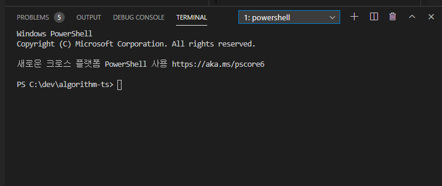
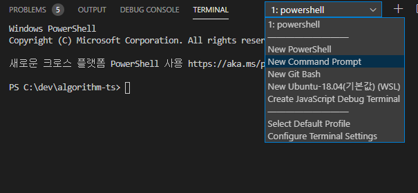
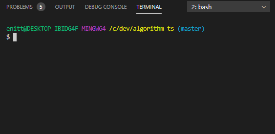
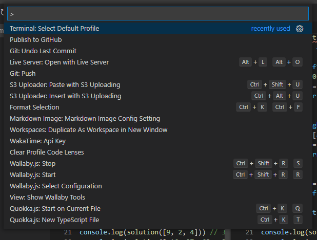
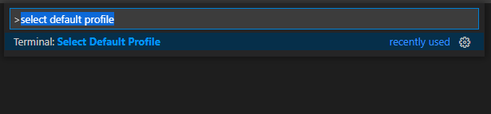
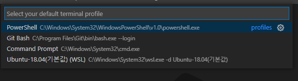

## VS Code의 터미널

VS Code에서는 현재 작업 중인 폴더의 터미널을 간편하게 열 수 있습니다.

**Ctrl+`(키보드에서 1 왼쪽에 있음)**를 누르면 터미널을 사용할 수 있습니다.

윈도우를 기준으로 `PowerShell`이 기본 터미널로 지정되어 있습니다.

## 다른 터미널 사용하는 방법

색깔도 없고 딱딱한 `PowerShell`보다는 알록달록한 `Git Bash`를 사용하고 싶어졌습니다.

다른 터미널을 사용하려면 어떻게 해야 할까요?

오른쪽 위의 드롭다운 버튼을 누르면 이렇게 여러 터미널 중에 선택해서 사용할 수 있습니다.

알록달록한 `Git Bash`가 열렸습니다.

## 기본 터미널 변경 방법

VS Code를 새로 켜거나 터미널을 종료한 후 다시 열면 딱딱한 Power Shell이 우리를 반겨줍니다.

기본 터미널을 변경해봅시다.

---

1. `Ctrl + Shift + P` 버튼을 이용해 다음과 같은 창을 띄워줍니다.

2. **select default profile**을 검색해 다음과 같은 메뉴를 선택합니다.

3. 터미널 목록 중에 기본 터미널로 사용하고 싶은 터미널을 선택합니다.

기본 터미널이 변경되었습니다.

이제 터미널을 다시 켜도, VS Code를 다시 켜도, 컴퓨터를 재부팅해도 VS Code는 우리가 선택한 터미널로 열립니다.
