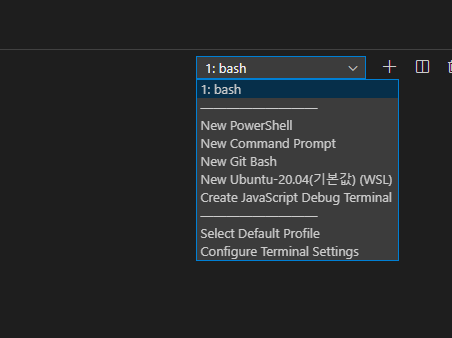

VS Code에서 **Ctrl+`(키보드에서 1 왼쪽에 있음)**를 누르면 터미널을 사용할 수 있습니다.

오른쪽 위의 드롭다운 버튼을 누르면 이렇게 여러 터미널 중에 선택해서 열 수도 있습니다.

그런데 기본 터미널을 변경하려면 어떻게 해야할까요?

## 변경 방법

`Settings` -> `terminal>Integrated: Cwd` 항목을 수정해줍니다.
