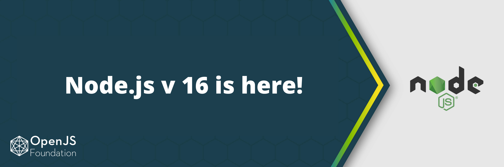

> 이 글은 [Node.js 16 available now](https://nodejs.medium.com/node-js-16-available-now-7f5099a97e70)를 번역한 글입니다.
> 원 글의 의도와 다소 차이가 있을 수 있습니다.

> 이 글은 Bethany Griggs가 작성했으며 Node.js 기술 운영위원회의 추가 기여를 받았습니다.

오늘 Node.js 16 릴리즈를 발표하게되어 기쁩니다! 하이라이트에는 V8 JavaScript 엔진을 9.0으로 업데이트, 사전 빌드 된 Apple Silicon 바이너리 및 추가 안정적인 API가 포함됩니다.



https://nodejs.org/en/download/current/ 에서 최신 릴리즈를 다운로드하거나 UNIX의 Node Version Manager를 사용하여 `nvm install 16`과 함께 설치할 수 있습니다. 변경 로그가 포함된 Node.js 블로그 게시물은 https://nodejs.org/en/blog/release/v16.0.0에서 확인할 수 있습니다.

처음에는 Node.js 16이 '현재'릴리즈 라인 인 Node.js 15를 대체합니다. [릴리즈 일정](https://github.com/nodejs/Release#release-schedule)에 따라 Node.js 16은 향후 6 개월 동안 '현재'릴리즈가 되고 2021 년 10 월에 LTS(장기 지원)로 승격됩니다. 일단 장기 지원으로 승격되면 릴리즈는 코드 명 '갈륨(Gallium)'으로 지정됩니다.

참고로 Node.js 12는 2022년 4월까지 장기 지원을 유지하고 Node.js 14는 2023 년 4 월까지 장기 지원을 유지합니다. Node.js 10은 종료 시점에 종료됩니다. 이번 달 (2021년 4월). 릴리즈 계획 / 일정에 대한 자세한 내용은 [Node.js Release Working Group repository](https://github.com/nodejs/release)에서 확인할 수 있습니다.

## V8 upgraded to V8 9.0

언제나 그렇듯이 V8 JavaScript 엔진의 새 버전은 성능 조정 및 개선을 제공 할 뿐만 아니라 JavaScript 언어 기능으로 Node.js를 최신 상태로 유지합니다. Node.js v16.0.0에서 V8 엔진은 Node.js 15의 V8 8.6에서 V8 9.0으로 업데이트되었습니다.

이 업데이트는 캡처된 문자열의 시작 및 끝 인덱스를 제공하는 ECMAScript RegExp Match Indices를 제공합니다. 인덱스 배열은 정규식에 /d 플래그가 있을 때 일치 개체의 .indices 속성을 통해 사용할 수 있습니다.

```js
> const matchObj = /(Java)(Script)/d.exec('JavaScript');
undefined

> matchObj.indices
[ [ 0, 10 ], [ 0, 4 ], [ 4, 10 ], groups: undefined ]

> matchObj.indices[0]; // Match
[ 0, 10 ]

> matchObj.indices[1]; // First capture group
[ 0, 4 ]

> matchObj.indices[2]; // Second capture group
[ 4, 10 ]
```

V8의 새 기능 및 업데이트에 대한 자세한 내용은 [V8 블로그](https://v8.dev/)를 참조하십시오.

## 안정된 Timers Promises API

Timers Promises API는 Promise 객체를 반환하는 대체 타이머 함수 세트를 제공하므로 `util.promisify()`를 사용할 필요가 없습니다.

```js
import { setTimeout } from 'timers/promises'
async function run() {
  await setTimeout(5000)
  console.log('Hello, World!')
}
run()
```

Node.js v15.0.0에 [James Snell](https://github.com/nodejs/node/pull/33950)이 추가했으며, 이 릴리즈에서는 실험적인 상태에서 안정적 상태로 졸업했습니다.

## Other recent features

릴리즈 프로세스의 특성상 약 2주마다 'Current' 릴리즈 라인에 새로운 기능이 릴리즈됩니다.

이러한 이유로 최신 Node.js 15 릴리즈에서는 많은 최신 추가 기능이 이미 제공되었지만 런타임에는 비교적 새로운 버전입니다.

Node.js 16에서도 사용할 수 있는 Node.js 15에서 최근에 출시된 기능 중 일부는 다음과 같습니다.

- 표준 [Web Crypto API](https://www.w3.org/TR/WebCryptoAPI/)의 실험적 구현
- npm 7 (v7.10.0 in Node.js v16.0.0)
- Node-API version 8
- [AbortController Web API](https://developer.mozilla.org/en-US/docs/Web/API/AbortController)에 기반한 안정적인 `AbortController` 구현
- Stable Source Maps v3
- 레거시 웹 플랫폼 API와의 호환성을위한 웹 플랫폼 atob(`buffer.atob(data)`) 및 btoa(`buffer.btoa(data)`) 구현

## 새로운 컴파일러 및 platform minimums

Node.js는 여러 플랫폼에 대해 사전 빌드된 바이너리를 제공합니다. 각 주요 릴리즈에 대해 최소 툴 체인은 평가되고 적절한 경우 상향 조정됩니다.

Node.js v16.0.0은 Apple Silicon 용으로 미리 빌드 된 바이너리를 제공하는 첫 번째 릴리즈가 될 것입니다. Intel(`darwin-x64`) 및 ARM(`darwin-arm64`) 아키텍처에 대해 별도의 tarball을 제공 할 예정이지만 macOS 설치 프로그램(`.pkg`)은 'fat'(다중 아키텍처) 바이너리로 제공됩니다.

이 바이너리의 제작은 MacStadium에서 프로젝트에 필요한 하드웨어를 기부하는 관대함 덕분에 가능했습니다.

Linux 기반 플랫폼에서 Node.js 16을 빌드하기 위한 최소 GCC 수준은 GCC 8.3이 됩니다. 지원되는 툴 체인 및 컴파일러에 대한 세부 정보는 Node.js [BUILDING.md](https://github.com/nodejs/node/blob/v12.x/BUILDING.md#platform-list) 파일에 문서화됩니다.

## 지원 중단

새로운 주요 릴리즈로서 새로운 런타임 지원 중단을 도입하는 시기이기도 합니다. Node.js 프로젝트는 주요 변경 사항에 대한 생태계 중단을 최소화하는 것을 목표로합니다.

이 프로젝트는 [CITGM](https://github.com/nodejs/citgm)(Canary in the Goldmine; 금광의 카나리아)이라는 도구를 사용하여 많은 인기 생태계 모듈에 대한 주요 변경 사항 (지원 중단 포함)의 영향을 테스트하여 이러한 변경 사항을 적용하기 전에 추가 통찰력을 제공합니다.

Node.js 16의 주목할 만한 지원 중단에는 `process.binding('http_parser')`과 같은 여러 핵심 모듈에 대한 `process.binding()` 액세스의 런타임 중단이 포함됩니다.

## 감사합니다!

새로운 주요 릴리즈는 모든 프로젝트 기여자와 Node.js 공동작업자의 노력의 총합이므로, 이번 기회를 통해 감사의 말씀을 드립니다.

특히, 릴리즈를 만들고 테스트 할 수있는 인프라를 확보하고 Node.js 16 용 툴 체인에 필요한 업그레이드를 수행 한 [Node.js Build Working Group](https://github.com/nodejs/build)에 감사드립니다.
