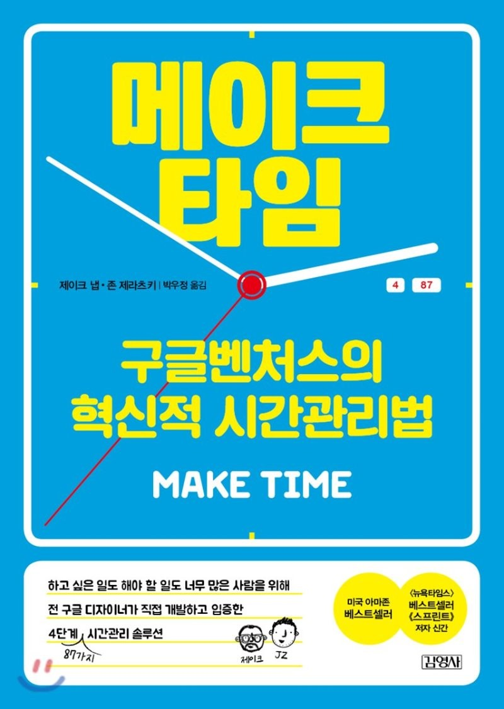

구글의 두 직원이 이야기하는 시간을 관리하고 하루하루를 충만하게 살기 위한 방법들

매 하루하루를 흘려보내는 일이 많아 개선을 위해 읽었다.

## 전술

이 책에서는 하루를 아래와 같은 순서로 보낼 것을 권장한다.

1. 하이라이트
2. 초집중
3. 돌아보기

- (틈틈히) 에너지 충전

### 하이라이트

> 초점을 선택하는 것으로 하루를 시작하라

- 하루에 하나 가장 주의를 기울일 `하이라이트`를 정한다.
  - 하이라이트는 60~90분 정도 소요되는 것이 적당하다.
  - 하이라이트는 잠들기 전이나 아침에 글로 써라.
- 우선순위가 높은 하나의 목표로 하루를 시작해라.
  - 마법 같은 일이 벌어질 것이다.
- 하이라이트를 처리하지 못했다면 ?
  - 더 중요한 일을 처리했다면 그걸로 된 것이다.
  - 타임리프를 하는 영화 주인공처럼 하루를 더 살아라

### 초집중

> 방해꾼을 물리쳐 하이라이트를 위한 시간을 만들어라

- 하루의 결승선을 정해둔다
  - 녹초가 될 때까지 일하는 것보다 내일을 위해 에너지를 비축해두는 것이 더 생산적이다.
- 오늘 인피니티풀을 거부하기 힘들면 내일은 더 힘들어진다.
- 주의 분산 크립토나이트를 차단해라
  - 나를 약하게 하는 것들 : 유튜브, 티비, 웹툰 등등
- 마감시간을 정해라

### 에너지 충전

> 뇌를 충전하기 위해 몸을 돌보아라

### 돌아보기

> 시스템을 조절하고 개선하라

## 기타

- '언젠가'가 바로 오늘이 되게 하라.(미루지 마라!)

## 감상

-
