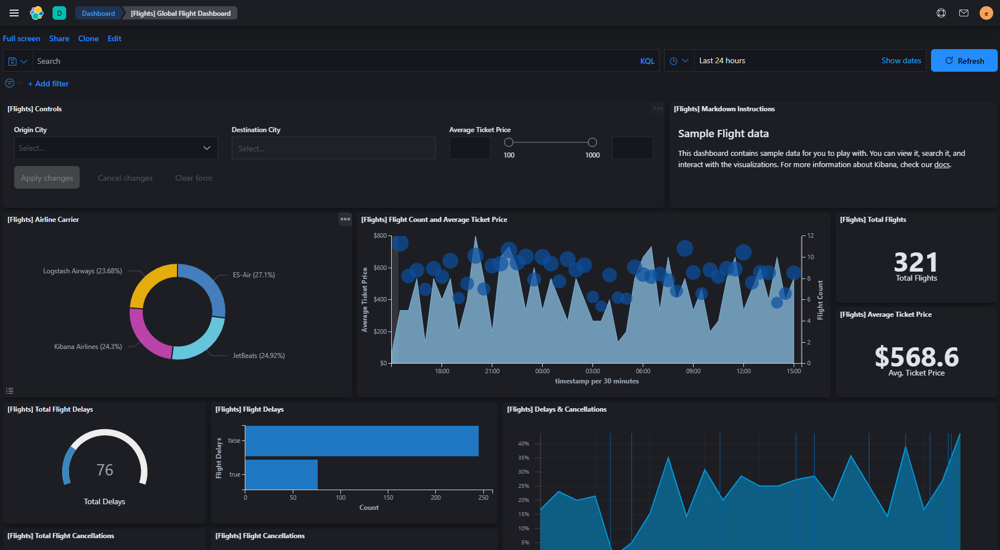

# Kibana는 Dark theme가 없어서 구려요😐

사내 로그 수집용으로 ELK 스택을 구축했다.

수집된 로그를 Kibana를 이용해 시각화하고 있는데 다른 분이 Grafana를 추천해주셨다.

## Kibana vs Grafana

kibana와 Grafana 모두 훌륭한 시각화 도구인데 추천해주신 분 말씀 중에 이런 말이 있었다.

> Kibana는 Dark theme가 없어서 구려요 😐

그 말을 듣고 궁금증이 생겼다.

**Kibana는 검은색 테마가 없을까?? **

# Kibana Dark theme?

`kibana dark theme`으로 검색해보니 아래와 같은 페이지를 찾을 수 있었다.

[Kibana 7.0.0 released | Elastic Blog
](https://www.elastic.co/kr/blog/kibana-7-0-0-released)

Kibana 7.0.0부터 Dark theme이 지원된다는 이야기

현재 사용하고 있는 버전이 7.9.1이니 당연히 지원되겠지.

찾아보자.

## Dark theme 설정 방법

참고로 Dark theme는 각 Space 별로 따로 적용된다.
A 스페이스에 적용한다고 B 스페이스도 Dark Theme로 바뀌지 않는다는 소리

위와 같이 설정하고 저장 후 페이지를 새로고침하면 Dark theme가 적용된다.

**쨔쟌**

# 마무리

Kibana는 공식적으로 Dark Theme를 제공하지만 그걸 알기가 힘들 정도로 꽁꽁 숨겨놨다.
그래서 나는 당연히 Dark Theme가 없는 줄로만 알았다.
이 글을 보는 다른 사람들도 Kibana에 Dark Theme이 존재하는 것을 알았으면 하는 마음에 글을 쓴다. 🤗
