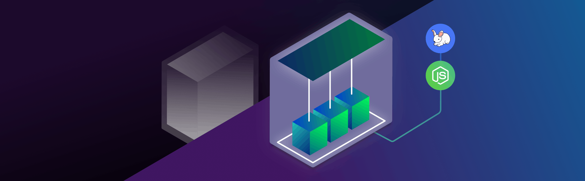
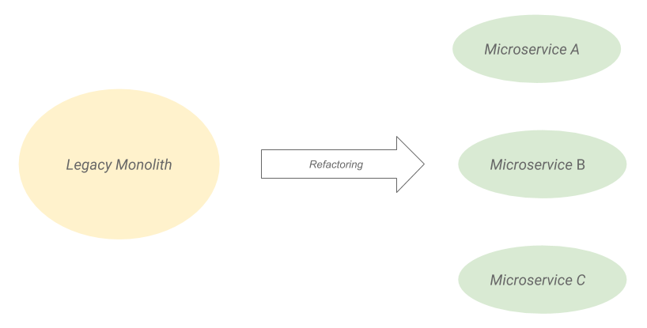
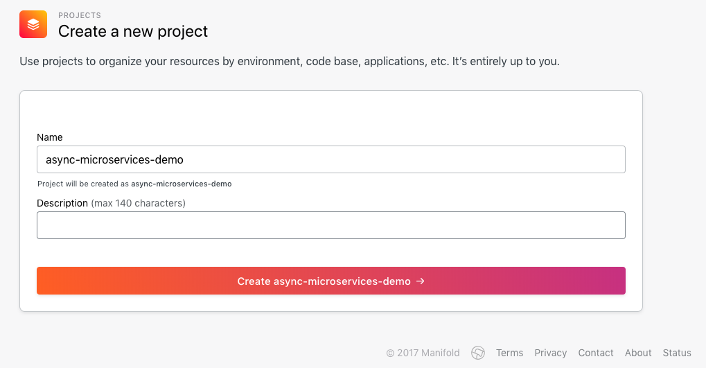
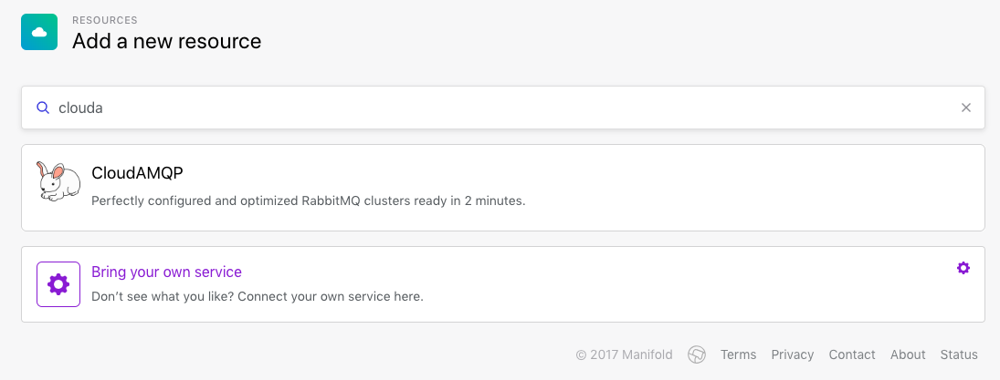
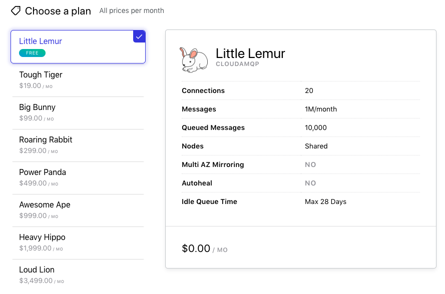
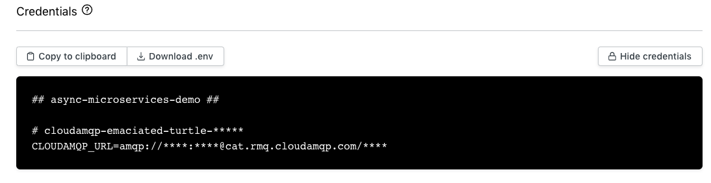
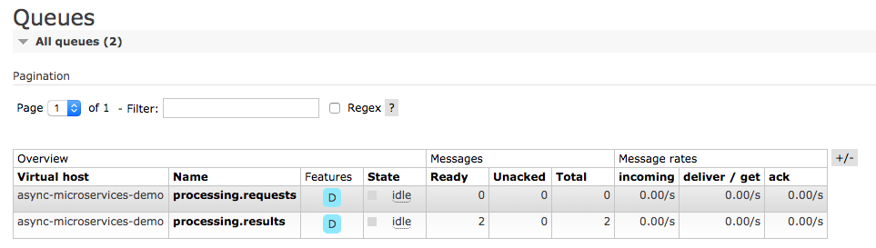

_메세지와 이벤트를 통한 확장성과 내결함성._


> 이 글은 [Asynchronous Microservices with RabbitMQ and Node.js](https://manifold.co/blog/asynchronous-microservices-with-rabbitmq-and-node-js)를 번역한 글입니다.
>
> 해당 글은 2019년 2월 19일에 작성되었습니다.

웹의 거인 (Netflix, Amazon…)은 10 년 이상 마이크로 서비스를 사용해 왔습니다. 그러나 최근에 이러한 기술은 소규모 소프트웨어 프로젝트에서 더 쉽게 접근 할 수 있게 되었습니다. 이제 신생 기업은 이를 활용하여 강력하고 확장 가능한 클라우드 소프트웨어를 구축할 수 있습니다.

이 문서에서는 RabbitMQ 및 Node.js를 사용하여 마이크로 서비스를 시작하는 간단한 방법을 살펴봅니다.

## 마이크로 서비스란 무엇인가요?

저는 Martin Fowler의 간단한 정의를 좋아합니다.:

> A particular way of designing software applications as suites of independently deployable services.
> (소프트웨어 응용 프로그램을 독립적으로 배포 할 수있는 서비스 모음으로 설계하는 특별한 방법입니다.)
>
> – MARTIN FOWLER

전통적인 Monolith 앱은 API 요청, 인증, 여러 작업에 대한 백그라운드 데이터 처리 등을 처리합니다. 아이디어는 각각 더 작은 작업 집합을 처리하는 특수 마이크로 서비스로 분할하는 것입니다.



## 마이크로 서비스 통신 패턴

이제 모놀리스를 여러 서비스로 분할 했으므로 이들이 협업 할 수있는 방법을 설정해야합니다. 서비스 간 통신에 사용되는 가장 일반적인 2 가지 패턴은 다음과 같습니다.

- Remote Procedures
- Asynchronous Messaging

### Remote Procedures

**Remote Procedures**는 기본적으로 서비스 A에서 서비스 B로 직접 요청을 보내고 **동기적**으로 응답을 기다립니다. 이를 달성하기 위한 기술의 예로는 [REST](https://en.wikipedia.org/wiki/Representational_state_transfer) 및 [gRPC](https://en.wikipedia.org/wiki/GRPC)가 있습니다.

### Asynchronous Messaging

**Asynchronous Messaging**에는 별도의 계층 또는 메시지 브로커를 사용하여 서비스 A에서 서비스 B로 메시지를 보냅니다. 서비스 A는 응답을 기다리지 않습니다. 서비스 B는 일반적으로 동일한 메시징 시스템을 통해 결과를 사용할 수 있을 때 (결과가 예상되는 경우) 결과를 보냅니다.

> Don’t call us, we’ll call you
> (우리한테 전화 하지마. 우리가 너에게 전화할게.)
>
> — ASYNCHRONOUS MESSAGING

이를 달성하기 위해 활용할 수있는 기술의 예로 [RabbitMQ](https://www.rabbitmq.com/)와 [Apache Kafka](https://kafka.apache.org/)가 있습니다.

## 내결함성 데이터 처리 서비스 구축

마이크로 서비스의 간단한 사용 사례를 설명하기 위해 REST API를 통해 외부 요청을 수신하고 데이터에 대해 비용이 많이 드는 처리를 수행하고 결과를 저장하는 웹 애플리케이션을 구축 할 것입니다.


이 앱의 요구 사항은 다음과 같습니다.

- 내결함성 : 시스템의 다른 부분에 영향을주지 않고 데이터 처리가 실패 할 경우 재시도되기를 원합니다.
- 확장성 : 우리는 웹 API와 독립적으로 데이터 처리 기능을 확장 할 수 있기를 원합니다.

### Monolith 솔루션의 문제

이 문제를 해결하는 한 가지 방법은 이 프로세스의 모든 단계를 처리하는 단일 앱을 빌드하는 것입니다. 그러나 이 접근 방식에는 다음과 같은 문제가 있습니다.

- 앱에 새롭고 독립적인 기능을 추가하면 어떻게 되나요? 이러한 각 기능을 어떻게 효율적으로 확장 할 수 있습니까?
- 엔드 포인트 중 하나에서 매우 크고 예상치 못한 또는 잘못된 요청을 수신하면 어떻게 됩니까? 전체 앱이 다운 되나요?

### 2-서비스 동기 솔루션(2-services synchronous solution)의 문제

우리는 앱을 *WebService*와 *ProcessorService*의 두 가지 서비스로 분할할 것입니다.

- **WebService**는 들어오는 API 요청을 처리하고 요청을 ProcessorService에 전달하고 ProcessorService에서 받은 결과를 기록합니다.
- **ProcessorService**는 WebService에서 가져온 데이터를 처리하고 결과를 다시 보냅니다.

**WebService**와 **ProcessorService**가 통신하는 방법으로 REST API를 사용하려면 다음과 같은 잠재적인 문제를 처리해야합니다.

- WebService가 연결을 시도할 때 ProcessorService가 오프라인 상태 일 수 있습니다. 그럼 어떻게 할까요? 어딘가에 요청을 저장하고 나중에 다시 시도합니까? 언제 다시 시도해야 합니까? 얼마나 자주 시도해야하나요?
- 새 요청이 도착했을 때 ProcessorService의 용량이 가득 차 있을 수 있습니다.
- 데이터 처리 시도는 웹 서비스가 응답을 기다리는 동안 시간이 오래 걸리거나 실패 할 수 있습니다.
- ProcessorService가 데이터 처리를 완료했지만 WebService가 현재 오프라인 상태인 경우 결과를 어떻게 처리해야합니까?
- ProcessorService의 인스턴스를 더 추가하면 WebService에 요청을 보낼 인스턴스를 어떻게 알립니까?

## Node.js 및 RabbitMQ를 사용한 2-서비스 비동기 솔루션(2-services async solution)

이러한 문제에 대한 가능한 해결책은 WebService에서 ProcessorService로 메시지를 전달하고 ProcessorService에서 WebService로 메시지를 전달할 때 중개자 역할을 하는 "**메시지 브로커**"를 포함하는 것입니다. 이를 구현하는 데 사용할 기술은 다음과 같습니다.

- **RabbitMQ** : [웹 사이트](https://www.rabbitmq.com/)에는 "가장 널리 배포 된 오픈 소스 메시지 브로커"라고 나와 있습니다. 설치가 쉽고 유지 보수가 적으며 매우 빠르며 가장 널리 사용되는 프로그래밍 언어에 대한 라이브러리가 있습니다.
- **Node.js** : [Node.js](https://nodejs.org/en/)는 이 비동기 작업에 완벽한 이벤트 중심 프로그래밍 모델을 제공합니다.

### 도구 설정 코드

코드를 참조하고 따라 할 수 있도록 [github 저장소](https://github.com/didil/async-microservices-demo)를 설정했습니다.

#### Node.js 및 RabbitMQ 설정

[여기](https://nodejs.org/ko/)에서 다운로드 할 수있는 최신 Node.js LTS 릴리스 (이 기사 작성 시점의 10.15.0)_(역주_ 번역 당시 LTS는 14.16.0입니다.)\*를 사용할 것입니다.

RabbitMQ를 시작하는 가장 쉬운 방법은 [CloudAMQP](https://www.manifold.co/services/cloudamqp)를 사용하는 것입니다. 그들은 RabbitMQ를 서비스로 제공하므로 RabbitMQ를 구성하고 유지하는 대신 앱 구축에 집중할 수 있습니다. 이 방법으로 RabbitMQ를 설정하려면 몇 가지 간단한 단계 만 필요합니다.

무료 계정을 처음 [등록](https://dashboard.manifold.co/register?_ga=2.234264923.413065051.1615507491-1671984928.1615352998)하십시오. 그런 다음 프로젝트를 만듭니다.



프로젝트에 CloudAMQP 리소스를 추가합니다.



CloudAMQP 무료 플랜 선택 :



다음 화면에서“Show Credentials”를 클릭 한 다음“Download .env”를 클릭하십시오. 프로젝트 경로에서 파일 이름 ".env"로 파일을 저장합니다.



#### RabbitMQ 대기열 구성

이제 RabbitMQ 인스턴스를 사용할 준비가되었습니다. 다음 Node.js 스크립트를 실행하여 큐를 설정할 수 있습니다.

```js
require('dotenv').config()

const amqp = require('amqplib')

// RabbitMQ connection string
const messageQueueConnectionString = process.env.CLOUDAMQP_URL

async function setup() {
  console.log('Setting up RabbitMQ Exchanges/Queues')
  // connect to RabbitMQ Instance
  let connection = await amqp.connect(messageQueueConnectionString)

  // create a channel
  let channel = await connection.createChannel()

  // create exchange
  await channel.assertExchange('processing', 'direct', { durable: true })

  // create queues
  await channel.assertQueue('processing.requests', { durable: true })
  await channel.assertQueue('processing.results', { durable: true })

  // bind queues
  await channel.bindQueue('processing.requests', 'processing', 'request')
  await channel.bindQueue('processing.results', 'processing', 'result')

  console.log('Setup DONE')
  process.exit()
}

setup()
```

위의 스크립트에서 수행한 작업은 다음과 같습니다.

- exchange _“processing”_ 선언
- 2 개의 queues 선언 : *"processing.requests"*는 요청을 저장하고 *"processing.results"*는 결과를 저장합니다.
- queues를 exchange에 바인딩

[여기](https://www.rabbitmq.com/tutorials/amqp-concepts.html)서 RabbitMQ 개념에 대한 자세한 내용을 읽을 수 있지만 일반적인 아이디어는 `WebService`가 `processing.requests` 대기열로 요청을 보내고 `ProcessorService`는 거기에서 요청을 읽고 `WebService`가 액세스 할 수있는 `processing.results`에 결과를 게시한다는 것입니다.

#### WebService 코드

**WebService**에 대한 코드는 여기에서 찾을 수 있습니다. Express.js를 사용하여 엔드 포인트 `/api/v1/processData`에 대한 `POST` 요청을 처리하는 웹 API입니다. 각 요청에 requestId를 할당하고이를 RabbitMQ에 보내고 requestId를 응답으로 표시합니다. 서비스는 또한 ProcessorService의 결과를 수신하고 기록합니다.

```js
const path = require('path')
require('dotenv').config({ path: path.resolve(process.cwd(), '../.env') })

const express = require('express')
const app = express()
const http = require('http')
const bodyParser = require('body-parser')
const amqp = require('amqplib')

// Middleware
app.use(bodyParser.json())

// simulate request ids
let lastRequestId = 1

// RabbitMQ connection string
const messageQueueConnectionString = process.env.CLOUDAMQP_URL

// handle the request
app.post('/api/v1/processData', async function(req, res) {
  // save request id and increment
  let requestId = lastRequestId
  lastRequestId++

  // connect to Rabbit MQ and create a channel
  let connection = await amqp.connect(messageQueueConnectionString)
  let channel = await connection.createConfirmChannel()

  // publish the data to Rabbit MQ
  let requestData = req.body.data
  console.log('Published a request message, requestId:', requestId)
  await publishToChannel(channel, {
    routingKey: 'request',
    exchangeName: 'processing',
    data: { requestId, requestData },
  })

  // send the request id in the response
  res.send({ requestId })
})

// utility function to publish messages to a channel
function publishToChannel(channel, { routingKey, exchangeName, data }) {
  return new Promise((resolve, reject) => {
    channel.publish(
      exchangeName,
      routingKey,
      Buffer.from(JSON.stringify(data), 'utf-8'),
      { persistent: true },
      function(err, ok) {
        if (err) {
          return reject(err)
        }

        resolve()
      }
    )
  })
}

async function listenForResults() {
  // connect to Rabbit MQ
  let connection = await amqp.connect(messageQueueConnectionString)

  // create a channel and prefetch 1 message at a time
  let channel = await connection.createChannel()
  await channel.prefetch(1)

  // start consuming messages
  await consume({ connection, channel })
}

// consume messages from RabbitMQ
function consume({ connection, channel, resultsChannel }) {
  return new Promise((resolve, reject) => {
    channel.consume('processing.results', async function(msg) {
      // parse message
      let msgBody = msg.content.toString()
      let data = JSON.parse(msgBody)
      let requestId = data.requestId
      let processingResults = data.processingResults
      console.log(
        'Received a result message, requestId:',
        requestId,
        'processingResults:',
        processingResults
      )

      // acknowledge message as received
      await channel.ack(msg)
    })

    // handle connection closed
    connection.on('close', err => {
      return reject(err)
    })

    // handle errors
    connection.on('error', err => {
      return reject(err)
    })
  })
}

// Start the server
const PORT = 3000
server = http.createServer(app)
server.listen(PORT, 'localhost', function(err) {
  if (err) {
    console.error(err)
  } else {
    console.info('Listening on port %s.', PORT)
  }
})

// listen for results on RabbitMQ
listenForResults()
```

#### ProcessorService 코드

**ProcessorService**의 코드는 [여기](https://github.com/didil/async-microservices-demo/blob/master/processor-service/processor-service.js)에서 찾을 수 있습니다. RabbitMQ 채널 처리에서 요청 메시지를 수신하고 이전에 정의한 요청을 처리 한 후 결과를 채널 처리로 다시 보냅니다. 이 데모의 목적을 위해 5 초 동안 기다렸다가 입력 문자열 끝에 '-processed'를 연결하여 _heavy-processing_ 부분을 시뮬레이션합니다.

```js
const path = require('path')
require('dotenv').config({ path: path.resolve(process.cwd(), '../.env') })

const amqp = require('amqplib')

// RabbitMQ connection string
const messageQueueConnectionString = process.env.CLOUDAMQP_URL

async function listenForMessages() {
  // connect to Rabbit MQ
  let connection = await amqp.connect(messageQueueConnectionString)

  // create a channel and prefetch 1 message at a time
  let channel = await connection.createChannel()
  await channel.prefetch(1)

  // create a second channel to send back the results
  let resultsChannel = await connection.createConfirmChannel()

  // start consuming messages
  await consume({ connection, channel, resultsChannel })
}

// utility function to publish messages to a channel
function publishToChannel(channel, { routingKey, exchangeName, data }) {
  return new Promise((resolve, reject) => {
    channel.publish(
      exchangeName,
      routingKey,
      Buffer.from(JSON.stringify(data), 'utf-8'),
      { persistent: true },
      function(err, ok) {
        if (err) {
          return reject(err)
        }

        resolve()
      }
    )
  })
}

// consume messages from RabbitMQ
function consume({ connection, channel, resultsChannel }) {
  return new Promise((resolve, reject) => {
    channel.consume('processing.requests', async function(msg) {
      // parse message
      let msgBody = msg.content.toString()
      let data = JSON.parse(msgBody)
      let requestId = data.requestId
      let requestData = data.requestData
      console.log('Received a request message, requestId:', requestId)

      // process data
      let processingResults = await processMessage(requestData)

      // publish results to channel
      await publishToChannel(resultsChannel, {
        exchangeName: 'processing',
        routingKey: 'result',
        data: { requestId, processingResults },
      })
      console.log('Published results for requestId:', requestId)

      // acknowledge message as processed successfully
      await channel.ack(msg)
    })

    // handle connection closed
    connection.on('close', err => {
      return reject(err)
    })

    // handle errors
    connection.on('error', err => {
      return reject(err)
    })
  })
}

// simulate data processing that takes 5 seconds
function processMessage(requestData) {
  return new Promise((resolve, reject) => {
    setTimeout(() => {
      resolve(requestData + '-processed')
    }, 5000)
  })
}

listenForMessages()
```

#### 결과 탐색

**WebService**만 실행하고 터미널에서 몇 가지 요청을 보내는 것으로 시작합니다.

```bash
$ *cd web-service
$ node web-service.js
*Listening on port 3000.

*// From a different terminal
*$ *curl --header "Content-Type: application/json" \
  --request POST \
  --data '{"data":"my-data"}' \
  [http://localhost:3000/api/v1/processData](http://localhost:3000/api/v1/processData)*

{"requestId":1}

$ *curl --header "Content-Type: application/json" \
  --request POST \
  --data '{"data":"more-data"}' \
  [http://localhost:3000/api/v1/processData](http://localhost:3000/api/v1/processData)*

{"requestId":2}
```

각 인스턴스는 메시지를 처리했습니다. RabbitMQ 대시 보드로 돌아가서 결과가 대기열에 있음을 확인합니다.



마지막으로 웹 서비스를 다시 시작합니다.

```bash
$ cd web-service
$ node web-service.js
Received a result message, requestId: 1 processingResults: my-data-processed
Received a result message, requestId: 2processingResults: more-data-processed
```

대시 보드를 다시 확인하면 모든 메시지가 처리되었으므로 두 대기열이 모두 비어 있어야합니다.

분리 된 아키텍처 덕분에 더 많은 **WebService** 또는 **ProcessorService** 인스턴스를 독립적으로 추가하여이 앱을 확장 할 수 있습니다. 실패한 메시지는 RabbitMQ에 자동으로 다시 추가되어 앱이 좀 더 강력 해집니다.

## 결론

이 글에서는 CloudAMQP를 통해 Node.js + RabbitMQ를 살펴 보았지만 RabbitMQ를 다음과 같은 다른 솔루션으로 대체 할 수 있습니다.

- **Apache Kafka** : 디자인이 약간 다르지만 매우 인기있는 대안입니다. Kafka의 한 가지 흥미로운 점은 수신 된 모든 메시지를 순서대로 저장하고 재생할 수 있다는 것입니다. RabbitMQ는 수신을 확인하면 메시지를 삭제합니다.
- **Google Cloud Platform PubSub 및 AWS SQS** : Google 및 AWS의 대체 독점 솔루션입니다. 이러한 클라우드 공급자 중 하나를 선호하는 경우 편리 할 수 ​​있습니다.

마지막으로 솔루션을 프로덕션에 배포하는 데 몇 가지 추가 단계가 필요합니다.

- 고 가용성 설정 사용. 단일 RabbitMQ 인스턴스 설계는 시스템의 단일 장애 지점이됩니다.
- 단위 및 통합 테스트 추가.
- 중앙 집중식 로깅 및 모니터링.
- 배포를 간소화하기 위해 각 마이크로 서비스에 대한 [Docker](https://www.docker.com/) 컨테이너를 빌드합니다.
