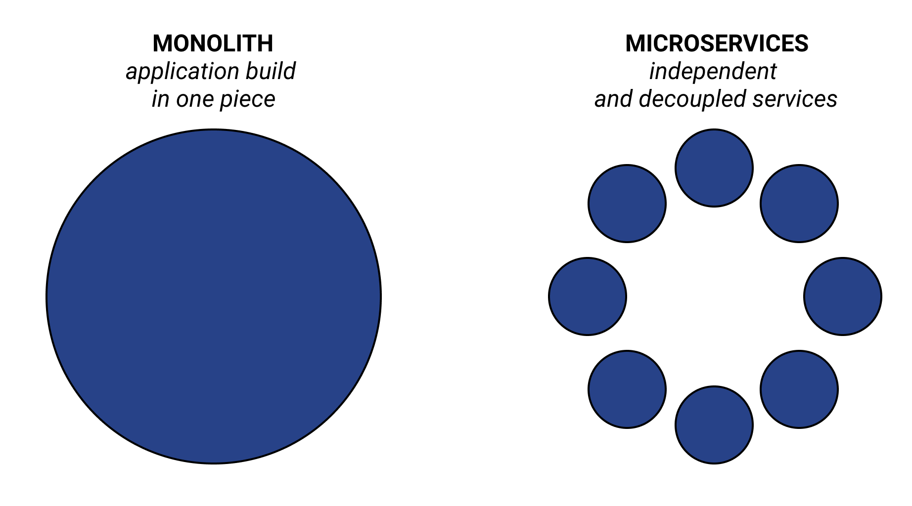
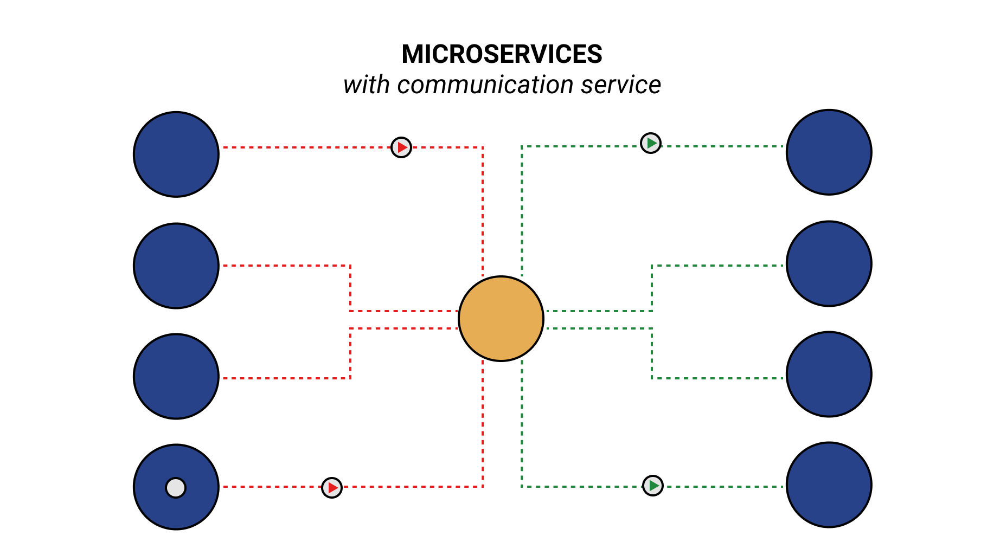
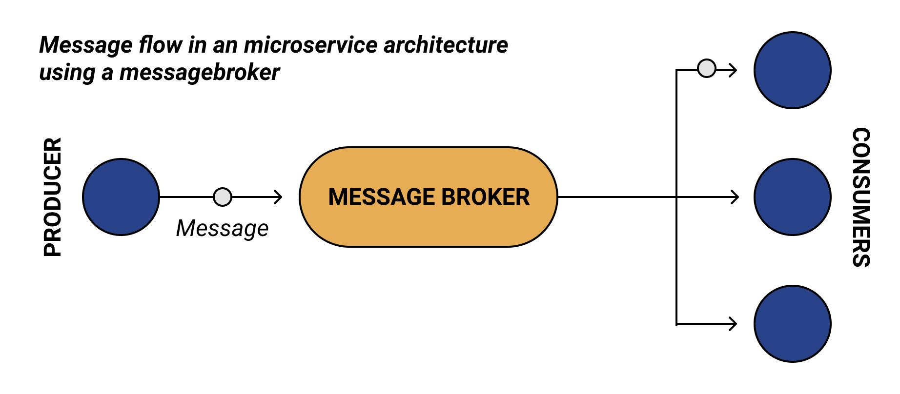

> 이 글은 [Microservices - why use RabbitMQ?](https://www.cloudamqp.com/blog/why-use-rabbitmq-in-a-microservice-architecture.html)를 번역한 글입니다.
>
> 다소 오역이 있을 수 있습니다.
>
> RabbitMQ as a Service를 제공하는 [CloudAMQP](https://www.cloudamqp.com/)의 글이기 때문에 [RabbitMQ](https://www.rabbitmq.com/)를 사용하는 경우의 장점이 다소 부각되어 있을 수 있습니다.

오늘날 개발자들은 단일 시스템이 아닌 Microservices 아키텍처를 사용하여 애플리케이션을 구축하기로 선택합니다. 그 이유를 이해하기 위해서 Message Queue와 함께 Microservices 아키텍처에서 [RabbitMQ](https://www.rabbitmq.com/)같은 메시지 브로커를 사용하는 이점에 대해 자세히 살펴봐야 합니다.

이 글에서는 Microservices 시스템과 Message Queue 사용간의 상관 관계를 자세히 살펴보고 다음 질문에 답합니다.

- Microservices 아키텍처에서 RabbitMQ를 사용해야하는 이유는 무엇입니까?

## monolith에서 microservices로의 전환

두 가지 유형의 시스템 아키텍처 간의 차이를 알고 있겠지만 리마인드를 위해 주요 차이점을 살펴보겠습니다.

**Monolithic architecture**는 종종 단일 시스템에 포함된 전체 기능과 크고 복잡하며 긴밀하게 결합됩니다.

이러한 아키텍처에는 몇 가지 단점이 있습니다.

**첫 번째 단점은 유지하기가 어렵다는 것**입니다. `monolith architecture`는 작은 변경이 전체 시스템에 영향을 미칠 수 있으며, 이는 다양한 문제를 일으킬 수 있습니다.

대신 `microservice architecture`로 전환하면 기능을 독립 실행형 구성요소(functionality into standalone components)로 분리하여 이런 문제를 해결할 수 있습니다.

따라서 아키텍처의 다른 부분에 영향을 끼치지 않고 기능을 추가, 변경 혹은 삭제하는 것이 쉬워집니다.

예를 들어 `microservice architecture`를 사용하는 온라인 쇼핑몰에서 갑자기 이메일로 영수증을 보내지 못하는 경우에 이 작업을 담당하는 프로세스가 문제를 일으키더라도 시스템의 다른 부분에 문제가 발생하지 않을 수 있습니다.

"이메일로 영수증 보내기"로 전송된 작업/메시지는 Microservices가 다시 온라인 상태가 될 때까지 대기열에 올려놓기만 하면 나머지 스토어는 항상 평상시와 같이 운영될 수 있습니다.

자세히 알아 보려면 이것을 시청하세요: ["Video: Microservices and Message Queues - Explained"](https://www.youtube.com/watch?v=r5byURobuaQ)

## Microservices의 이점은 무엇입니까?

Microservices 아키텍처를 통해 기업은 애플리케이션을 쉽게 확장하고 유지할 수 있습니다.

각 파트의 개발, 테스트 및 업데이트를 지속적으로 개별적으로 수행 할 수 있습니다.

Microservices 아키텍처는 소프트웨어 개발 및 유지 관리에 대한보다 민첩한 접근 방식을 허용하기 때문에 다양한 산업 및 조직에 매력적입니다.

## Microservice 란 무엇입니까?

개별 Microservice는 일반적으로 단일 목적으로만 존재하며, 독립적이며 다른 인스턴스 및 서비스와 무관한 서비스입니다.

Microservices 아키텍처 스타일로 애플리케이션을 구축할 때 접근 방식은 둘 이상의 소규모 서비스(Microservices)로 구성된 단일 애플리케이션을 개발하는 것입니다.

각 마이크로서비스는 별도로 개발되며, 완료된 애플리케이션은 모든 마이크로서비스의 합계입니다(the finished application is the sum of all the microservices).

## Microservices는 어떻게 연결됩니까?

Microservices 또는 모듈은 서로 분리되어 있지만 여전히 통신 할 수 있습니다.

교차 종속성은 Microservices 아키텍처에서 일반적입니다.

즉, 다른 서비스의 도움 없이는 단일 서비스를 수행 할 수 없습니다.

다음과 같이 Microservices 간의 연결로 사용할 여러 서비스가 있습니다.

- Brokers ([RabbitMQ](https://www.rabbitmq.com/)나 [Kafka](https://kafka.apache.org/) 같은)
- Remote Prodecure Calls (RPC)
- REST APIS

Microservices 애플리케이션을위한 옵션으로서 Brokers, Message queuing 및 RabbitMQ에 대해 자세히 살펴 보겠습니다.

## Message queuing이란 무엇입니까?

Message Queues를 사용하면 응용 프로그램의 일부가 메시지를 대기열에 비동기식으로 푸시하고 올바른 대상으로 전달되는지 확인할 수 있습니다.

Message queuing을 구현하려면 RabbitMQ와 같은 메시지 브로커가 좋은 옵션입니다.

메시지 브로커는 수신 서비스가 사용 중이거나 연결이 끊어졌을 때 임시 메시지 저장소를 제공합니다.

## 브로커와의 통신 처리

메시지 브로커는 마이크로서비스의 중개자 역할을 하며, 한 애플리케이션(producers)에서 메시지를 수신하여 다른 애플리케이션(consumers)에게 메시지를 전달하여 작업을 수행합니다.

예를 들어, RabbitMQ 메시지 브로커를 사용하면 메시지가 큐에 직접 게시되지 않습니다.

대신 producers가 exchange으로 메시지를 보냅니다.

exchange의 작업은 consumers가 응용 프로그램의 메시지를 수락하고 올바른 메시지 큐로 전달하는 것입니다.

메시지는 consumers가 처리하여 제거할 때까지 대기열에 남아 있습니다.

<!--  -->

선택할 수 있는 메시지 브로커 두 가지가 있습니다.

브로커 중 하나를 선택할 때는 요구 사항을 정확히 파악해야 합니다.

RabbitMQ와 Apache Kafka는 두 개의 오픈 소스 메시지 브로커이며, 이 비교에서 이들 간의 주요 차이점에 대해 읽을 수 있습니다: "[When to use RabbitMQ or Apache Kafka](https://www.cloudamqp.com/blog/when-to-use-rabbitmq-or-apache-kafka.html)"입니다.

## Microservices 아키텍처에서 브로커 역할을하는 RabbitMQ

RabbitMQ는 비동기 처리를 가능하게합니다. 즉, 메시지를 즉시 처리하지 않고 큐에 넣을 수 있습니다.

따라서 RabbitMQ는 장기 실행 작업(long-running tasks) 또는 차단 작업(blocking tasks)에 이상적이며, 웹 서버가 현장에서 계산 집약적인 작업(computationally intensive tasks)을 수행하지 않고 요청에 신속하게 응답 할 수 있습니다.

RabbitMQ는 단순히 메시지를 저장하고 준비가되면 consumers에게 전달합니다.

<!--  -->

- **RabbitMQ는 신뢰할 수있는 오픈 소스 메시지 브로커입니다.**

  - 2007 년부터 출시되었으며 Pivotal 소프트웨어 2013의 일부가되었습니다. 지속적으로 업데이트되고 개선되고 있습니다.
  - RabbitMQ에는 추가 기능, 개선 사항 및 편리한 플러그인을 생성하는 강력한 커뮤니티와 매우 활동적인 핵심 팀이 있습니다.
  - RabbitMQ의 라이선스는 변경되지 않았습니다 (2019 년 11 월).

- **RabbitMQ는 기본적으로 AMQP 0.9.1을 구현하는 AMQP, MQTT, STOMP 등과 같은 여러 표준화 된 프로토콜을 지원합니다.**

  - 다양한 표준화 된 메시지 프로토콜을 지원하는 RabbitMQ의 기능은 다양한 시나리오에서 사용할 수 있으며 RabbitMQ 브로커를 AMQP 기반 브로커로 대체 할 수 있음을 의미합니다.

- **RabbitMQ는 다양한 산업 분야의 많은 회사에서 사용하고 있으며 대기업 (Zalando, WeWork, Wunderlist, Bloomberg 등)에서 사용하고 신뢰합니다.**

  - 모두 Microservices 기반 아키텍처에 의존합니다.

- **RabbitMQ는 사용자 친화적이며 이러한 RabbitMQ 모범 사례를 따르면 의도 한 목적에 맞게 구성을 쉽게 조정할 수 있습니다.**

  - RabbitMQ는 Erlang으로 작성되었으며 세계에서 가장 많이 배포 된 오픈 소스 메시지 브로커입니다.
  - 즉, 잘 테스트되고 강력한 브로커입니다.

- **RabbitMQ 브로커는 확장 가능하고 유연합니다.**

  - 팀은 대기열과 메시지를주고받는 producer와 consumer만 유지하면됩니다.
  - 부하가 높을 때 대기열이 커지면 consumer를 더 추가하고 작업을 병렬화하는 것이 표준입니다.
  - 이것은 간단하고 효과적인 확장 방법입니다.

## RabbitMQ로 확장

메시지가 consumer가 처리 할 수있는 속도보다 더 빠른 속도로 큐에 전달되는 경우 큐는 계속 증가합니다.

다행히도 확장은 두 가지 방법으로 수행 할 수 있습니다.

consumer를 쉽게 추가하거나 제거 할 수 있습니다.

또한 브로커가 확장 (CPU / 디스크 / 메모리를 통해 더 많은 리소스 추가)하도록 허용하여 큐에서 더 많은 메시지를 처리 할 수 있습니다.

그러나 RabbitMQ는 짧은 대기열에서 가장 빠르게 작동합니다.

## 요약 - 그래서, RabbitMQ를 사용하는 이유는 무엇입니까?

다재다능하고 신뢰할 수있는 메시지 브로커를 찾고 있다면 RabbitMQ가 좋은 옵션입니다.

RabbitMQ 커뮤니티는 강력하고 성장하고 있으며 많은 문서와 지원을 찾을 수 있습니다.

아래는 다양한 RabbitMQ 사용 사례를 보여주는 비디오입니다.

[Youtube - RabbitMQ Explained - Use Cases](https://youtu.be/oq1fOr6Ryws)

~~RabbitMQ 사용에 관심이있는 경우 CloudAMQP는 RabbitMQ를위한 클라우드 호스팅 서비스이며 완전 관리 형 인스턴스를 제공합니다. 시작하려면 여기에서 무료 요금제에 가입하세요.~~
