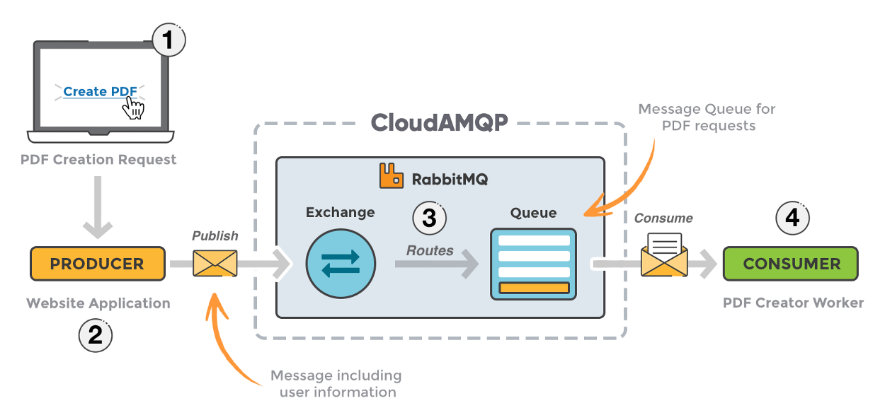

> 이 글은 [Need of messaging queue in Microservices Architecture](https://medium.com/startlovingyourself/need-of-messaging-queues-in-microservices-architecture-91de0db89120)를 번역한 글입니다.

[지난 글](https://medium.com/startlovingyourself/microservices-vs-monolithic-architecture-c8df91f16bb4))에서는 `microservices architecture` 사용의 이점을 강조하고 `monolithic architecture` 사용의 단점에 초점을 맞춘 `microservices vs monolithic architecture`에 대해 작성했습니다.

이제 당신은 `microservices architecture`의 장점과 동작 방식, 애플케이션 확장, 배포, 새로운 기능의 더 빠른 제공, 단일 실패 지점에서의 구원이 어떻게 도움이 되는지 알게되었습니다.

`microservices architecture`를 이용해 새로운 애플리케이션을 작성하게 되어 기쁩니다. 마이크로 서비스 아키텍처를 최대한 활용하기 위해 따라야 할 특정 표준 또는 관행이 있습니다. 그리고 `메세지 큐`([RabbitMQ](https://www.rabbitmq.com/), [kafka](https://kafka.apache.org/) or etc)는 그 중 하나입니다. 나는 다음 시리즈의 기사에서 나머지 관행에 대해 계속 쓰고 있습니다. 하지만 **메세지 큐**를 사용하는 이유는 무엇입니까? 그것을 사용하지 않으면 어떻게 되나요? **메세지 큐**이 마이크로 서비스 아키텍처의 특정 시나리오에서 우리의 삶을 어떻게 쉽게 만들어 주는지 살펴 보겠습니다.

이제 당신에게 사용자가 다양한 아이템을 구매하는 전자 상거래 애플리케이션이 있다고 가정 해 보겠습니다.
그리고 고객들은 주문이나 리뷰같은 활동에 따라 특정 로열티 포인트 또는 쿠폰을 얻습니다.
6 개월마다 사용자의 과거 활동 흐름을 확인하고 멤버십 레벨, 로열티 포인트 또는 쿠폰을 업데이트하려고 합니다.
이제 이러한 세부 정보를 사용자에게 보낼 수 있는 솔루션을 제안해야 합니다.
여기에 두 가지 서비스가 있다고 가정 해 보겠습니다. 첫 번째는 이러한 속성을 계산하는 것이고 두 번째는 기본적으로 메일, SMS, 푸시 알림을 통해 최종 사용자에게 알림을 보내는 것입니다.
따라서 많은 수의 스레드로 처리 할 수 있는 첫 번째 서비스에 엄청난 수의 요청을 받습니다.
그런 다음 최종 사용자에게 알림을 보내는 메시징 서비스를 터치?하고 싶을 것입니다.

<!--  -->

이를 처리 할 수있는 두 가지 방법이 있습니다. 첫 번째는 메시징 서비스에 외부 호출을 하고 응답을 기다리는 **rest 동기 모델**입니다.

두 번째는 **메시징 기반 비동기 모델**입니다.

<!--  -->

첫 번째 접근 방식에서는, 엄청난 양의 요청이 있을 수 있기 때문에 매우 짧은 시간에 응답할 수 없는 것과 같은 문제가 상당히 발생하며, 외부 통화를 동기적으로 할 때마다 외부 서비스에서 응답을 받을 때까지 현재 스레드를 차단합니다.
외부 서비스가 중단된 경우가 있을 수 있습니다.
메시징 서비스의 외부 종속성에 대해 확신할 수 없습니다.
응답 지연이 발생할 수 있습니다.

동시에 이러한 변경/이벤트를 대기열/주제로 밀어넣고 사용자에게 다시 응답하는 두 번째 접근 방식을 사용할 경우에도 마찬가지입니다.
또한 여러 수신자가 이러한 메시지를 비동기적으로 처리할 수 있도록 하여 성능 향상에 도움이 될 수 있습니다.
여러 노드에서 실행할 경우 고가용성 측면에서 결과를 얻을 수 있습니다.
따라서 메시지를 대기열에 밀어넣으면 작업이 완료됩니다.
메시지 대기열에서 휴식을 취합니다.
그리고 당신은 여기 아무것도 막고 있지 않습니다.
따라서 소비자/수신자는 대기열에서 메시지를 읽고 비동기식으로 처리할 수 있습니다.
메시징 기반 모델을 사용하는 예는 더 많을 수 있습니다.

<!--  -->

기본적으로 일관성 유지를 위해 변경 이벤트를 다른 마이크로서비스로 푸시하는 대기열 기반 비동기 모델을 사용하는 몇 가지 사용 사례를 더 볼 수 있습니다.
당신이 가맹점 측에서 업로드한 제품을 관리하는 카탈로그 팀과 협력하고 있으며, 당신의 어플리케이션에 있는 제품의 깨끗한 스키마에 매핑하고 있다고 가정해 보겠습니다.
매핑이 완료되면 이 매핑 이벤트를 다른 서비스(예: 검색 서비스)로 전송해야 하며, 이를 기반으로 매핑된 제품을 제공합니다.
검색이 이 메시지를 수신하면 다음 번에 사용자가 검색할 때 매핑된 제품에 대한 올바른 결과를 제공하도록 해당 제품을 업데이트할 수 있습니다.
제품 서비스에서 특정 제품의 속성이 일부 변경되었다고 가정합니다.
이러한 변경 사항을 기본적으로 제품에 기반을 둔 일부 로직을 사용하는 다른 마이크로 서비스에 적용할 수도 있습니다.
그리고 이 두 가지 예를 보면, 이것을 처리하기 위해 현재 스레드를 차단하고 싶지 않을 것입니다.
보조 서비스에서도 응답을 받을 수 있는 사용 사례를 하나 더 생각해 보겠습니다.
메시지 대기열은 단방향 통신을 제공하므로 반대 방향으로 한 개의 대기열이 더 있어야 합니다.

<!--  -->

따라서 메시징 기반 비동기식 모델을 통해 외부 서비스가 중단된 경우, 높은 지연 시간, 가용성, 변경 이벤트를 애플리케이션 성능에 심각한 영향을 미칠 수 있는 여러 마이크로서비스로 전송하는 등 특정 시나리오에서 사용자의 삶을 쉽게 만들 수 있습니다.
또한 마이크로 서비스 간에 느슨한 결합을 제공합니다.
