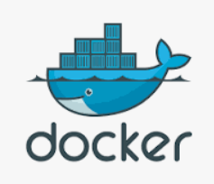

# 개요

docker로 구성된 logstash 컨테이너를 수정할 일이 있었습니다.

해당 컨테이너의 로그를 보려고 아래 명령어를 입력한 순간...

```bash
docker logs log01
```


쌓여있던 로그가 미친듯이 뿜어져나와 제가 보고 싶은 메세지를 보는데 한참이 걸렸죠.

이 문제를 해결하려면 어떻게 해야 할까요?

# docker logs ?

docker logs는 컨테이너의 로그를 조회할 수 있는 명령어입니다.

아래와 같은 형태로 이뤄집니다.

```bash
docker logs [OPTIONS] CONTAINER
```

`[OPTIONS]`에 옵션을 부여해주면 저희가 보고싶은대로 log를 볼 수 있습니다.

## 실험 환경

```
docker run --name test -d busybox sh -c "while true; do $(echo date); sleep 1; done"
```

간단하게 log가 계속 찍히는 컨테이너를 생성했습니다.

컨테이너 이름은 test입니다.


이 컨테이너를 이용해 실습해보겠습니다.

## 사용 사례

### 마지막에 찍히는 10개의 로그만 보고 싶어 🤔

```
docker logs --tail 10 <CONTAINER>
```


`--tail n` 옵션을 사용하면 끝에서 n개의 로그만 출력합니다.

### 지금부터 생성되는 로그도 보고 싶어 🤔

```
docker logs -f <CONTAINER>
```


`-f` 옵션을 사용하면 로그를 출력하고 프로세스를 종료하는 것이 아니라 계속해서 로그를 추적합니다.

### 기존의 로그를 무시하고 새로 생성되는 로그만 보려면

```
docker logs -f --tail 0 <CONTAINER>
```


이전 n개의 로그를 출력하고 신규 로그를 추적하고 싶다면 `--tail <n>`으로 수정하면 됩니다.

### 특정 메세지가 들어간 로그만 보고 싶은데 🤔

```bash
docker logs test | grep :20
```


linux의 `grep` 기능을 활용하면 쉽습니다.

grep 이후에 검색하고자하는 text를 넣어주시면 됩니다.

# 참조

[Docker logs 공식 문서
](https://docs.docker.com/engine/reference/commandline/logs/)

# 마치며

해당 포스트에 추가가 필요한 꿀팁이나 수정사항이 있으시면 언제든 피드백 주시면 감사하겠습니다. 😄
