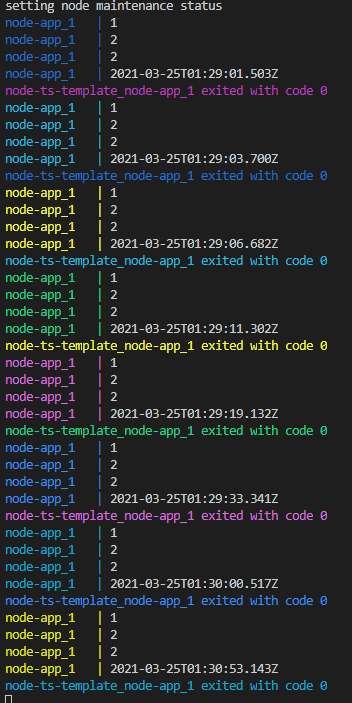
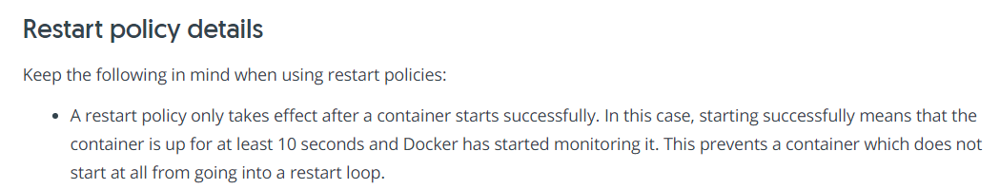
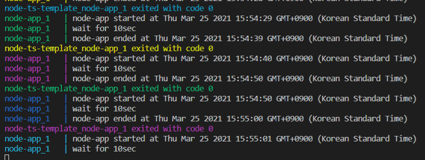

도커 리스타트 정책 확인용으로 실험 중 특이사항이 있어 기록 & 공유합니다.

> ## 요약
>
> - 컨테이너의 실행시간이 짧으면 Docker restart의 주기가 길어질 수 있다.
> - 이럴 때에는 컨테이너 실행 시간을 10초 이상으로 늘려보면 도움이 될 수 있다.

## 개요

Docker를 이용해 Microservices Architecture 설계 중 개념 증명을 위해 Restart 기능을 포함한 실험을 수행하였습니다.

node-app이라는 컨테이너는 다음과 같이 동작하고 `restart=always`를 인자로 받았기 때문에 종료 후 바로 다시 실행될 것을 예상하였습니다.

1. 실행 후 특정 텍스트를 출력 (webpack, babel 설정 후 테스트를 하던 중 입력된 의미없는 텍스트입니다.)
2. 1초 후 현재시각 출력
3. 종료

예상되는 동작은 `실행 -> 종료 -> 재실행`입니다.



위 사진은 docker-compose를 이용해서 node-app이라는 컨테이너를 실행한 사진입니다.

종료시 출력하는 시간을 잘 보시면 컨테이너가 실행되는 주기가 점점 길어지고 있다는 것을 알 수 있습니다. (1초 -> 53초)

실제 동작은 `실행 -> 종료 -> n초의 대기 -> 재실행`입니다. n은 0초부터 시작하여 점점 늘어납니다. (최대 60초)

여기서 왜 `n초의 대기시간`이 발생하는지 의문이었습니다.

## 실험 환경

### docker-compose.yml

```yml
version: '3.7'

services:
  node-app:
    build:
      context: .
      dockerfile: dockerfiles/node-app.dockerfile
    restart: always
    environment:
      TZ: Asia/Seoul
```

### node-app.dockerfile

```docker
FROM node:14-alpine
WORKDIR /usr/src/app
COPY package*.json ./
RUN npm install --production
COPY . .
CMD [ "node", "dist/main.js" ]
```

### node-app

```ts
console.log(1)
console.log(2)
console.log(2)

setTimeout(() => {
  console.log(new Date())
}, 1000)
```

OS는 windows입니다.

환경에는 나오지 않았지만 Typescript를 사용하는 nodejs 환경을 구성하였고 작성한 .ts 파일을 webpack과 babel을 이용해 js 파일로 컴파일했습니다.

컴파일 후 dist/main.js 파일을 이용해 node-app image를 만들었습니다.

빌드된 node-app 이미지를 `restart=always` parameter와 함께 실행하였습니다.

## 원인

그럼 docker의 restart는 1분 주기로 일어나는 걸까요?

결과적으로 이야기하면 아닙니다.

실행 상황의 특수성(컨테이너의 실행시간이 극도로 짧음)으로 발생한 현상입니다.

Docker 공식 문서의 [Start containers automatically](https://docs.docker.com/config/containers/start-containers-automatically/) 부분을 보면 이러한 내용이 나옵니다.



restart 정책이 작동하는 경우는 컨테이너가 `정상적으로 시작하고 도커의 모니터링이 시작된 경우`입니다.

테스트 환경에서는 node-app 컨테이너가 약 1초간 동작하고 종료되었기 때문에 `정상적인 실행`이 아닌 `비정상적인 실행`으로 처리됩니다.

따라서 리스타트 정책이 정상적으로 실행되지 않습니다.

재시작 주기가 늘어나는 부분은 도커 문서 등에서 확인하지 못하였으나 컨테이너가 정상적으로 실행되지 못하였을 때 계속 재시작하는 과정에서 발생하는 자원의 낭비를 막기 위한 최적화 방법 중 하나라고 판단됩니다.

## 결론

node-app container의 동작 시간을 10초로 늘렸을 때에는 기대하던대로 정상적으로 동작합니다. (프로세스 종료 후 바로 재실행)



컨테이너가 종료된 후 약 1초 후 재시작됩니다.

## 정리

도커 컨테이너 운용 시 단발적으로 실행되는 서비스가 있을 수 있습니다. (ex. 배치 파일 or 메세지 큐 확인 등)

이러한 컨테이너는 시작된 후 처리할 데이터가 없는 경우 10초 이하의 가동시간을 가지고 프로세스가 종료되는 경우가 있을 수 있습니다. 이럴 때 `정상적이지 않은 동작`으로 판단되어 실제와 다르게 동작할 수 있습니다.

컨테이너가 종료 후 바로 실행되지 않는 등의 예상과 다른 동작을 하는 경우 동작 시간을 조정해보는 것이 도움이 될 수 있습니다.
