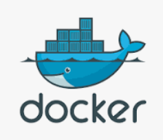

보통의 컨테이너는 다음과 같은 생명 주기를 가집니다.


생성되고시작하고 동작하다가 정지하고 삭제되죠.주요 명령어들과 위의 상태주기를 함께 보겠습니다.

## Create

```bash
docker create docker create

```

이미지를 통해 컨테이너를 생성합니다.
생성 후 컨테이너는 Created 상태로 존재합니다.
이미지에는 파일 스냅샷과 커맨드가 있는데요.

Created 는 파일 스냅샷이 컨테이너의 저장공간에 적재되고 커맨드가 실행되지 않은 상태입니다.


```bash
docker creater debian
```


## Start

```bash
docker start <container-id>start
```

컨테이너를 실행시킵니다.
Create 상태에서는 컨테이너에 파일 스냅샷이 적재된 상태인데요.
이 상태에서 start 상태가 되면 이미지의 Command가 컨테이너에서 실행됩니다.


```bash
docker start b3c

```


## Run

```bash
docker run 

```


위의 create - start 보다 한방에 처리 가능한 run 을 주로 사용하실텐데요
run 커맨드는 생성, 시작을 동시에 하는 명령어입니다.

```bash
docker run -it debian

```

ubuntu 나 debian 같은 대화형 프로세스가 필요한 경우 -it 옵션을 사용하면 대화형 bash shell 을 사용할 수 있습니다.

## Stop, Kill

동작 중인 컨테이너를 중지하고 싶을 때 Stop과 Kill이 있다.두 명령어 다 컨테이너를 중지시키는 기능인데 왜 두 개의 명령어로 나누어져 있을까?

```bash
docker stop <container-id or container-name>

```

stop은 자비롭게 컨테이너를 기다려준다.
현재 동작하고 있는 작업을 종료하고 컨테이너를 중지시킨다.

```bash
docker kill <id or name>

```

kill은 컨테이너의 작업을 기다려주지 않는다.
현재 무슨 작업을 하고 있던 간에 컨테이너를 종료한다.

## SIGTERM , SIGKILL


도커 공식문서의 stop과 kill 부분에 SIGTERM과 SIGKILL에 대한 내용이 나온다.
kill은 바로 SIGKILL 시그널을 보낸다.
stop은 SIGTERM 시그널을 보내고 유예기간 후에 SIGKILL 시그널을 보낸다.
