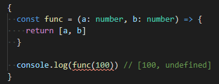

## JS에서 함수 파라미터를 채우지 않고 건네주면 어떻게 될까? 🤔

```js
{
  const func = (a, b) => {
    return [a, b]
  }

  console.log(func(100)) // [100, undefined]
}
```

위 예제에서 보듯 전달받지 못한 파라미터의 값은 `undefined`가 됩니다.

그럼 파라미터의 값을 덜 채워보내더라도 값을 가지게 하고 싶으면 어떻게 해야할까요?

## 기본 파라미터(default parameter)

값이 없거나 undefined가 전달될 경우에 사용할 기본값을 지정할 수 있습니다.

## in 자바스크립트(JavaScript)

JS에서 `default parameter`를 사용하려면 아래와 같이 `parameter_name = default_value` 형태로 지정해주면 됩니다.

```js
const func = (a, b = 10) => {
  return [a, b]
}

// default parameter 미사용
console.log(func(100, 20)) // [100, 20]

// defalut parameter 사용
console.log(func(100)) // [100, 10]
```

## in 타입스크립트(Typescript)



타입스크립트에서는 함수의 파라미터 개수와 다른 수의 파라미터가 전달되는 경우 에러로 표시해줍니다.


`default parameter`를 사용하면 파라미터가 비어있어도 에러가 발생하지 않습니다.

타입스크립트에서는 `parameter_name : type = default_value` 형태로 지정해주세요.

```ts
const func = (a: number, b: number = 10) => {
  return [a, b]
}

// default parameter 미사용
console.log(func(100, 20)) // [100, 20]

// defalut parameter 사용
console.log(func(100)) // [100, 10]
```

## 참조

- <https://developer.mozilla.org/ko/docs/Web/JavaScript/Reference/Functions/Default_parameters>
