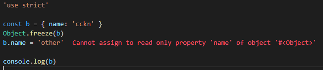

## const와 object

자바스크립트의 `const`는 `변경이 불가능한 변수`를 선언합니다.

하지만 객체(object)의 값은 const로 선언되더라도 수정이 가능합니다.

```js
const a = { name: 'cckn' }
a['name'] = 'someone'
```

우리가 변경 불가능한 것은 변수에 할당된 객체의 주소값이지 객체 내부의 값들이 아닙니다.

그럼 객체의 값을 변경하지 못하도록 보호하고 싶으면 어떻게 해야할까요?

## 객체의 수정을 제한하는 방법

[Object.freeze()](https://developer.mozilla.org/ko/docs/Web/JavaScript/Reference/Global_Objects/Object/freeze) 함수를 사용하면 객체의 수정을 막을 수 있습니다.

```js
const b = { name: 'cckn' }
Object.freeze(b)
b.name = 'other'

console.log(b) // { name: 'cckn' }
```

위 예제에서 `b`라는 객체를 선언 후 `freeze`했습니다.

그리고 b 내부의 name값을 변경하였습니다.

그리고 b를 출력하였으나 b.name은 변경되지 않았습니다.

우리가 원하던대로 값이 객체 값이 변경되지 않았네요.

## 보호된 객체에 대한 수정이 이루어졌을 때 에러를 발생시키고 싶어요

위 예제에서는 보호된 객체에 수정이 가해졌으나 아무런 반응없이 넘어가고 있습니다. 이를 `조용한 실패`라고 합니다.

이는 개발자 입장에서 의도된 것일 수 있지만 아닌 경우 잠재적인 에러를 발생시킬 수 있습니다.

그리고 에러를 발생시키지 않기 때문에 버그를 찾기 매우 어렵습니다.

이럴 때 에러를 발생시키고 싶다면 ['use strict'](https://developer.mozilla.org/ko/docs/Web/JavaScript/Reference/Strict_mode) 키워드를 파일 최상단에 넣어주면 됩니다.



## 객체가 보호상태인지 알고 싶어요

객체가 보호 중인지 확인하고 싶다면 [Object.isFrozen()](https://developer.mozilla.org/ko/docs/Web/JavaScript/Reference/Global_Objects/Object/isFrozen)을 사용하세요.

```js
const b = { name: 'cckn' }
console.log(Object.isFrozen(b)) // false
Object.freeze(b)
console.log(Object.isFrozen(b)) // true
```

## 객체를 보호하는 다른 방법

객체를 보호하는 다른 방법에는 [Object.seal()](https://developer.mozilla.org/ko/docs/Web/JavaScript/Reference/Global_Objects/Object/seal)과 [Object.preventExtensions()](https://developer.mozilla.org/ko/docs/Web/JavaScript/Reference/Global_Objects/Object/preventExtensions)이 있습니다.

각 보호 방법의 차이점은 아래와 같습니다.

|                            | 추가 | 삭제 | 변경 |
| -------------------------- | ---- | ---- | ---- |
| Object.freeze()            | X    | X    | X    |
| Object.preventExtensions() | X    | X    | O    |
| Object.seal()              | X    | O    | O    |

## 참조

- <https://developer.mozilla.org/ko/docs/Web/JavaScript/Reference/Global_Objects/Object/freeze>
- <https://developer.mozilla.org/ko/docs/Web/JavaScript/Reference/Global_Objects/Object/isFrozen>
- <https://developer.mozilla.org/ko/docs/Web/JavaScript/Reference/Global_Objects/Object/seal>
- <https://developer.mozilla.org/ko/docs/Web/JavaScript/Reference/Global_Objects/Object/preventExtensions>
- <https://developer.mozilla.org/ko/docs/Web/JavaScript/Reference/Strict_mode>
