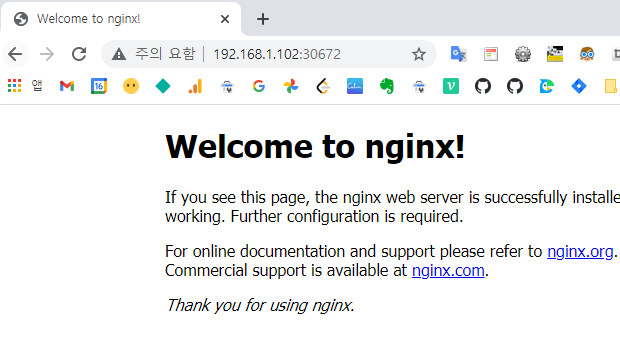

> 이 글은 [조훈](https://www.inflearn.com/users/@kubernetes)님의 [쉽게 시작하는 쿠버네티스(Kubernetes)](https://www.inflearn.com/course/%EC%BF%A0%EB%B2%84%EB%84%A4%ED%8B%B0%EC%8A%A4-%EC%89%BD%EA%B2%8C%EC%8B%9C%EC%9E%91/dashboard)를 학습하는 과정에서 기록하였습니다.
>
> 강의 내용과 다소 차이가 있을 수 있으니 정확한 학습을 위해서는 강의를 참조해주세요.

이 글에서는 쿠버네티스를 시작하는 사람을 위해 가장 작은 구성단위인 파드(pod)를 생성하고 외부에서 접속 가능하도록 노출하는 방법을 기술하겠습니다.

아래와 같은 기능을 실습합니다.

- nginx 파드를 생성하여 구동시킨다.
- 외부에서 nginx 파드에 접속할 수 있도록 한다.

## 파드(pod)란?

> 가장 작고 단순한 쿠버네티스 오브젝트. 파드는 사용자 클러스터에서 동작하는 컨테이너의 집합을 나타낸다.
> 파드는 일반적으로 하나의 기본 컨테이너를 실행하기 위해서 구성된다. 또한 파드는 로깅과 같이 보완적인 기능을 추가하기 위한 사이드카 컨테이너를 선택적으로 실행할 수 있다. 파드는 보통 디플로이먼트에 의해서 관리된다.

## 파드를 생성하는 법

아래와 같은 명령어를 통해 nginx 파드를 생성해봅시다.

```bash
kubectl run nginx --image=nginx
```

여기서 앞의 nginx는 생성할 파드의 이름, 뒤의 nginx는 필요한 이미지 이름입니다.

아래와 같은 메세지가 나오면 성공입니다.

```bash
pod/nginx created
```

## 파드 정보 조회

우리가 만든 파드를 확인해봅시다.

```bash
kubectl get pod
```

아래와 같이 출력됩니다.

```bash
NAME    READY   STATUS    RESTARTS   AGE
nginx   1/1     Running   0          36s

# 상세 조회
NAME    READY   STATUS    RESTARTS   AGE   IP             NODE     NOMINATED NODE   READINESS GATES
nginx   1/1     Running   0          45s   172.16.132.1   w3-k8s   <none>           <none>
```

상세 조회를 원하면 `-o wide`를 추가합니다.

```bash
kubectl get pod -o wide
```

아래와 같이 `IP, NODE, NOMINATED NODE, READINESS GATES`의 정보가 추가된 것을 확인할 수 있습니다.

```bash
NAME    READY   STATUS    RESTARTS   AGE   IP             NODE     NOMINATED NODE   READINESS GATES
nginx   1/1     Running   0          45s   172.16.132.1   w3-k8s   <none>           <none>
```

## 파드 동작 확인

파드의 IP를 curl을 이용해 조회하면 아래와 같은 결과를 확인할 수 있습니다.

nginx 파드가 정상적으로 생성됐다는 것을 알 수 있습니다.

```bash
curl 172.16.132.1
```

```html
<!DOCTYPE html>
<html>
  <head>
    <title>Welcome to nginx!</title>
    <style>
      body {
        width: 35em;
        margin: 0 auto;
        font-family: Tahoma, Verdana, Arial, sans-serif;
      }
    </style>
  </head>
  <body>
    <h1>Welcome to nginx!</h1>
    <p>
      If you see this page, the nginx web server is successfully installed and
      working. Further configuration is required.
    </p>

    <p>
      For online documentation and support please refer to
      <a href="http://nginx.org/">nginx.org</a>.<br />
      Commercial support is available at
      <a href="http://nginx.com/">nginx.com</a>.
    </p>

    <p><em>Thank you for using nginx.</em></p>
  </body>
</html>
```

## 파드 외부로 노출시키기

nginx 파드가 만들어졌습니다.

하지만 아직 이 파드는 외부에서 접속이 불가능합니다.

우리가 어떠한 기능을 제공하기 위해서는 외부의 접속을 허용해줄 필요가 있습니다.

이 때 사용하는 것이 서비스입니다.

### 서비스를 이용해 파드를 외부에 오픈하기

```bash
kubectl expose pod nginx  --type=NodePort --port=80
```

아래와 같은 메세지가 출력되면 성공입니다.

```bash
service/nginx exposed
```

### 확인하기

서비스가 동작하고 있는지 확인해봅시다.

```bash
# input
kubectl get service

# output
NAME         TYPE        CLUSTER-IP      EXTERNAL-IP   PORT(S)        AGE
kubernetes   ClusterIP   10.96.0.1       <none>        443/TCP        72m
nginx        NodePort    10.97.222.166   <none>        80:30672/TCP   89s
```

노드의 정보를 확인해봅시다.

```bash
# input
kubectl get nodes -o wide

# output
NAME     STATUS   ROLES                  AGE   VERSION   INTERNAL-IP     EXTERNAL-IP   OS-IMAGE                KERNEL-VERSION                CONTAINER-RUNTIME
m-k8s    Ready    control-plane,master   74m   v1.20.2   192.168.1.10    <none>        CentOS Linux 7 (Core)   3.10.0-1127.19.1.el7.x86_64   docker://19.3.14
w1-k8s   Ready    <none>                 70m   v1.20.2   192.168.1.101   <none>        CentOS Linux 7 (Core)   3.10.0-1127.19.1.el7.x86_64   docker://19.3.14
w2-k8s   Ready    <none>                 66m   v1.20.2   192.168.1.102   <none>        CentOS Linux 7 (Core)   3.10.0-1127.19.1.el7.x86_64   docker://19.3.14
w3-k8s   Ready    <none>                 62m   v1.20.2   192.168.1.103   <none>        CentOS Linux 7 (Core)   3.10.0-1127.19.1.el7.x86_64   docker://19.3.14
```

### 브라우저에서 확인하기

nodes의 Internal-IP와 service의 port를 이용해 아래와 같은 정보로 접속 가능하다는 것을 알 수 있습니다.

- 192.168.1.10:30672
- 192.168.1.101:30672
- 192.168.1.102:30672
- 192.168.1.103:30672



4개의 노드 중 어디로 접속해도 nginx의 초기 페이지가 잘 보입니다.
