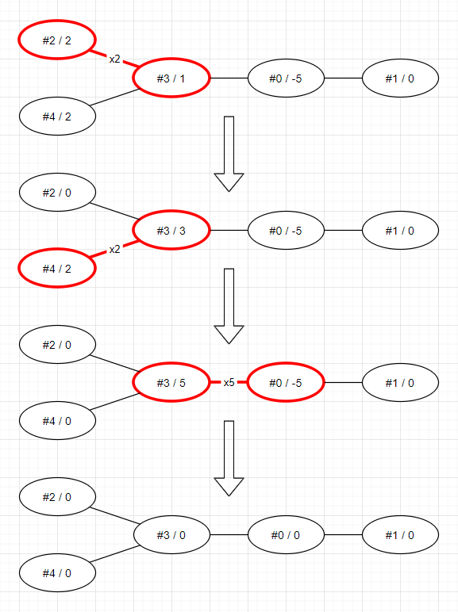
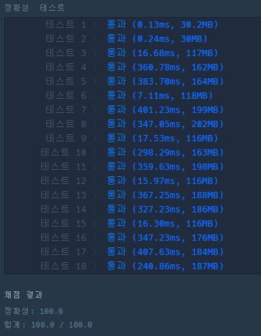

## [프로그래머스 - 모두 0으로 만들기](https://programmers.co.kr/learn/courses/30/lessons/76503)

프로그래머스 월간 코드 챌린지 시즌2 4월 3번 문제로 출제되었다



주어진 노드들의 값을 모두 0으로 만들어야 한다.

다른 언어들은 재귀를 이용한 DFS로 쓱싹 해결이 가능한데 JS는 Call Stack이 얕아 런타임 에러가 났다.

어쩔 수 없이 스택을 이용한 DFS로 해결하였다.(파이썬으로 풀면 스택 사이즈 조절이 가능하다.)



## 주의사항

- 정답을 BigInt로 처리해야 한다.(다른 언어라면 _long long_ 등)
  - 정답이 NodeJS의 *Number.MAX_SAFE_INTEGER*를 넘어가는 것으로 추정된다.
  - 매우 큰 수에 대해서는 연산의 정확도를 보장해주지 않아 오답이 나올 수 있다.
  - 따라서 매우 큰 수에 대해서도 정확한 연산을 해주는 BigInt 자료형으로 정답을 처리해야 한다.
  - 해당 처리를 해주지 않으면 테스트케이스 8번이 Wrong Answer로 처리된다.
- Root를 어디로 정해도 답은 똑같다.

## 풀이

기본적인 아이디어는 말단 노드에서부터 0으로 값을 만들어가는데 있다.

문제 설명에서는 한번씩 연산이 수행되는 것으로 나왔지만 그럴 필요는 없다.

- 전체 노드 값의 합이 0이 아닌 경우 정답이 나올 수 없기 때문에 `-1`을 반환한다

```js
if (arr.reduce((a, b) => a + b) !== 0) return -1
```

- 변수들을 선언하고 간선 정보를 **_tree_**에 넣어준다.(변수 이름은 tree이지만 그래프에 가깝다.)
- _nums_ 변수가 아니라 파라미터로 주어진 _a_ 배열을 사용해도 무방하지만 변수의 오염을 막기 위해 배열을 복사해 사용했다.
- *dfs*를 위한 *visited*와 *stack*도 선언한다.
  - *stack*에는 루트 노드(0)를 넣어준다.

```js
const tree = new Array(arr.length).fill(0).map(() => new Array())
const nums = arr.slice()
let result = BigInt(0)

edges.forEach(([a, b]) => {
  tree[a].push(b)
  tree[b].push(a)
})

const visited = new Array(arr.length).fill(false)
const stack = [[0, null]]
```

- 스택에 넣어줄 때는 타겟 노드와 부모 노드를 같이 넣어준다.
- 스택을 이용한 dfs와 동일하게 진행하되 방문하지 않은 노드일 경우 방문 처리를 하고 스택에 다시 넣어준다
- 상위 노드들부터 `stack`에 들어가게 되고 Bottom-up 방식으로 dfs가 수행된다.

```js
while (stack.length) {
  const [curr, parent] = stack.pop()

  if (visited[curr]) {
    result += BigInt(Math.abs(nums[curr]))
    nums[parent] += nums[curr]
    nums[curr] = 0
    continue
  }

  visited[curr] = true
  stack.push([curr, parent])

  for (const next of tree[curr]) {
    if (!visited[next]) stack.push([next, curr])
  }
}
return result
```

- **_leaf node_**들부터 **_if(visited[curr]){...}_**의 로직을 수행하게 된다.
- result에 현재 노드 값의 절대값을, 부모에 현재 노드 값을 추가한다.
- nums[curr]은 0으로 바꾸지 않아도 무방하다.

```js
if (visited[curr]) {
  result += BigInt(Math.abs(nums[curr]))
  nums[parent] += nums[curr]
  nums[curr] = 0
  continue
}
```

### 전체 소스코드

```js
function solution(arr, edges) {
  if (arr.reduce((a, b) => a + b) !== 0) return -1

  const tree = new Array(arr.length).fill(0).map(() => new Array())
  const nums = arr.slice()
  let result = BigInt(0)

  edges.forEach(([a, b]) => {
    tree[a].push(b)
    tree[b].push(a)
  })

  const visited = new Array(arr.length).fill(false)
  const stack = [[0, null]]

  while (stack.length) {
    const [curr, parent] = stack.pop()

    if (visited[curr]) {
      result += BigInt(Math.abs(nums[curr]))
      nums[parent] += nums[curr]
      nums[curr] = 0
      continue
    }

    visited[curr] = true
    stack.push([curr, parent])

    for (const next of tree[curr]) {
      if (!visited[next]) stack.push([next, curr])
    }
  }
  return result
}
```
