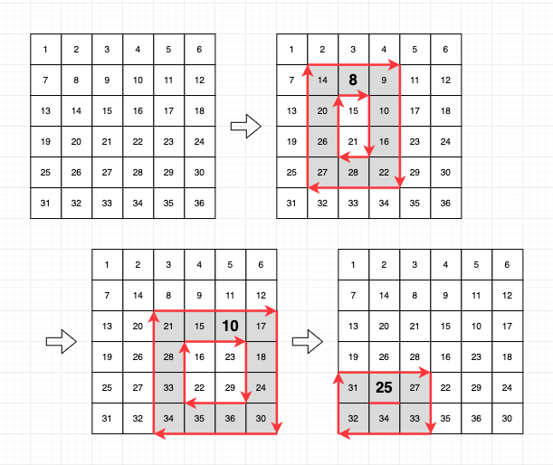

## [행렬 테두리 회전하기](https://programmers.co.kr/learn/courses/30/lessons/77485)



큐를 이용해서 해결하였다.

## 전체 소스코드

```js
function solution(rows, columns, queries) {
  var answer = []
  const board = Array(rows)
    .fill(0)
    .map(() => Array(columns))

  for (let i = 0; i < board.length; i++) {
    for (let j = 0; j < board[i].length; j++) {
      board[i][j] = i * columns + j + 1
    }
  }

  queries.forEach(query => {
    const [x1, y1, x2, y2] = query.map(pos => pos - 1)
    const queue = []

    for (let i = 0; i < y2 - y1; i++) queue.push(board[x1][y1 + i])
    for (let i = 0; i < x2 - x1; i++) queue.push(board[x1 + i][y2])
    for (let i = 0; i < y2 - y1; i++) queue.push(board[x2][y2 - i])
    for (let i = 0; i < x2 - x1; i++) queue.push(board[x2 - i][y1])

    queue.unshift(queue.pop())
    answer.push(Math.min(...queue))

    for (let i = 0; i < y2 - y1; i++) board[x1][y1 + i] = queue.shift()
    for (let i = 0; i < x2 - x1; i++) board[x1 + i][y2] = queue.shift()
    for (let i = 0; i < y2 - y1; i++) board[x2][y2 - i] = queue.shift()
    for (let i = 0; i < x2 - x1; i++) board[x2 - i][y1] = queue.shift()
  })
  return answer
}
```

## 풀이

#### 보드를 초기화한다

```js
const board = Array(rows)
  .fill(0)
  .map(() => Array(columns))

for (let i = 0; i < board.length; i++) {
  for (let j = 0; j < board[i].length; j++) {
    board[i][j] = i * columns + j + 1
  }
}
```

#### 쿼리를 순회하며 아래와 같이 수행한다

```js
queries.forEach(query => {
  const [x1, y1, x2, y2] = query.map(pos => pos - 1)
  ...
})
```

##### 큐에 순서대로 요소들을 담는다

```js
const [x1, y1, x2, y2] = query.map(pos => pos - 1)
const queue = []

for (let i = 0; i < y2 - y1; i++) queue.push(board[x1][y1 + i])
for (let i = 0; i < x2 - x1; i++) queue.push(board[x1 + i][y2])
for (let i = 0; i < y2 - y1; i++) queue.push(board[x2][y2 - i])
for (let i = 0; i < x2 - x1; i++) queue.push(board[x2 - i][y1])
```

##### 큐에서 가장 뒤에 있던 요소를 가장 앞으로 가져오고 최저값을 기록한다

```js
queue.unshift(queue.pop())
answer.push(Math.min(...queue))
```

##### 보드에 큐의 숫자들을 다시 기록한다

```js
for (let i = 0; i < y2 - y1; i++) board[x1][y1 + i] = queue.shift()
for (let i = 0; i < x2 - x1; i++) board[x1 + i][y2] = queue.shift()
for (let i = 0; i < y2 - y1; i++) board[x2][y2 - i] = queue.shift()
for (let i = 0; i < x2 - x1; i++) board[x2 - i][y1] = queue.shift()
```
