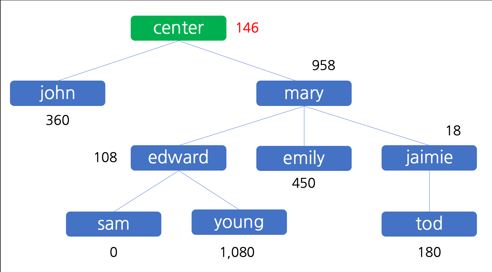

## [다단계 칫솔 판매](https://programmers.co.kr/learn/courses/30/lessons/77486)



트리를 순회하며 각 구성원이 받을 돈을 계산하는 문제

쉽게 쓱싹할 줄 알았는데 생각보다 고전했다.

## 전체 소스코드

```js
function solution(enroll, referral, seller, amount) {
  const tree = {}
  tree['-'] = { parent: null, reward: 0 }

  for (let i = 0; i < enroll.length; i++)
    tree[enroll[i]] = { parent: referral[i], reward: 0 }

  const bottomUp = (name, reward) => {
    const current = tree[name]
    if (!reward || !current.parent) return
    const rewardForParent = Math.floor(reward / 10)
    current.reward += reward - rewardForParent
    bottomUp(current.parent, rewardForParent)
  }

  for (let i = 0; i < seller.length; i++) {
    bottomUp(seller[i], amount[i] * 100)
  }

  return enroll.map(name => tree[name].reward)
}
```

## 풀이

#### 매개변수들을 이용해 각 구성원의 정보를 담은 object를 만든다.(parent, reward)

```js
const tree = {}
tree['-'] = { parent: null, reward: 0 }

for (let i = 0; i < enroll.length; i++)
  tree[enroll[i]] = { parent: referral[i], reward: 0 }
```

#### 판매정보를 순회하며 각 구성원이 가져가야 할 돈을 정산한다.

- 각 구성원이 가져간 돈의 10%를 추천인이 가져간다.
  - 추천인이 가져가는 돈은 0원 단위 절사한다. (아래 회원에게 9원을 받았다면 내 추천인에게 돈을 주지 않아도 된다.)
- 해당 연산은 추천인이 없거나 돈이 없을 때까지 재귀적으로 수행된다.

```js
const bottomUp = (name, reward) => {
  const current = tree[name]
  if (!reward || !current.parent) return
  const rewardForParent = Math.floor(reward / 10)
  current.reward += reward - rewardForParent
  bottomUp(current.parent, rewardForParent)
}

for (let i = 0; i < seller.length; i++) {
  bottomUp(seller[i], amount[i] * 100)
}
```

#### 결과 반환

enroll의 순서에 맞게 각 회원이 가진 돈을 반환한다.

```js
return enroll.map(name => tree[name].reward)
```

## 주의사항

- 원 단위 절사 과정에 유의하자.
- 판매정보(seller, amount)를 합해서 풀이하면 결과가 다르다. (원 절사 과정 때문)
