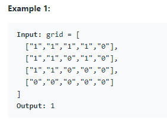

[링크](https://leetcode.com/problems/number-of-islands/)

## Number of Islands



0을 물, 1을 땅으로 했을 때 섬의 개수를 반환하는 문제

floodfill알고리즘으로 해결할 수 있다.

### 주의점

- grid를 복사하지 않고 사용한다면 원본으로 주어진 데이터를 오염시키게 된다.
  - 문제를 해결하는데에는 문제 없지만 경우에 따라서 문제가 될 수도 있는 부분
  - 되도록이면 원 데이터를 오염시키지 않도록 grid를 복사해서 사용하자.
- grid를 구성하는 요소들이 `0`, `1` 숫자가 아니라 `"0"`, `"1"` 문자열이다.
  - 약타입 언어를 쓴다면 헤멜 수도 있는 부분

### 해결

- `fill` 함수를 만들서어서 재귀적으로 파고든다.
  - `fill` 함수는 사방의 요소를 확인하고 `1`인 경우 해당 요소를 `0`으로 바꾸고 재귀적으로 다시 `fill`을 호출하는 함수
  - `0`으로 바꾸는 이유는 문제의 조건상 `0`으로 바꿔도 문제 없기 때문, 필요하다면 방문한(칠한?) 땅을 의미하는 `-1`이나 `2`로 바꿔도 된다.
- 최초 fill을 호출하는 경우(새로운 섬을 만난 경우)에 couut를 1 올린다.

```ts
function numIslands(grid: string[][]): number {
  const m = grid.length
  const n = grid[0].length

  const dx = [0, 0, -1, 1]
  const dy = [-1, 1, 0, 0]

  const tempGrid = grid.slice()

  const fill = (i: number, j: number) => {
    if (i < 0 || j < 0) return
    if (i >= m || j >= n) return
    if (tempGrid[i][j] !== '1') return

    tempGrid[i][j] = '0'
    for (let d = 0; d < dx.length; d++) {
      const x = dx[d]
      const y = dy[d]

      fill(i + x, j + y)
    }
  }

  let count = 0
  for (let i = 0; i < m; i++) {
    for (let j = 0; j < n; j++) {
      if (grid[i][j] === '1') {
        count++
        fill(i, j)
      }
    }
  }
  return count
}
```
