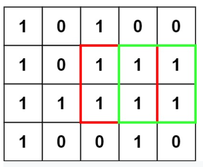
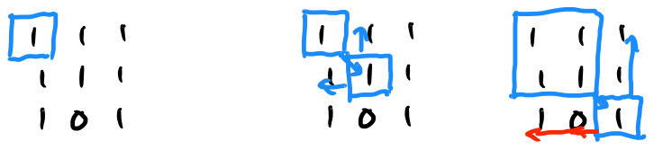

[링크](https://leetcode.com/problems/maximal-square/)

## Maximal Square



가장 큰 `1`로 이루어진 정사각형의 크기를 반환하는 문제

### 풀이



- 재귀적으로 해결
  - 이전에 파악한 사각형에서 대각선 아래`(x+1, y+1)`의 요소를 확인하고 해당 요소의 위와 왼쪽 요소를 `depth`개 만큼 확인한다.
  - 확인이 되지 않으면 그 전 크기를 반환한다.

```ts
function maximalSquare(matrix: string[][]): number {
  const m = matrix.length
  const n = matrix[0].length
  let max = 0

  const getSize = (x: number, y: number, depth: number): number => {
    if (x >= m || y >= n) return depth
    if (matrix[x][y] !== '1') return depth

    for (let i = 1; i < depth + 1; i++) {
      if (matrix[x][y - i] === '0' || matrix[x - i][y] === '0') {
        return depth
      }
    }

    return getSize(x + 1, y + 1, depth + 1)
  }

  for (let i = 0; i < matrix.length; i++) {
    for (let j = 0; j < matrix[0].length; j++) {
      if (matrix[i][j] === '1') {
        max = Math.max(1, max)
        const size = getSize(i, j, 0)
        max = Math.max(max, size * size)
      }
    }
  }
  return max
}
```
