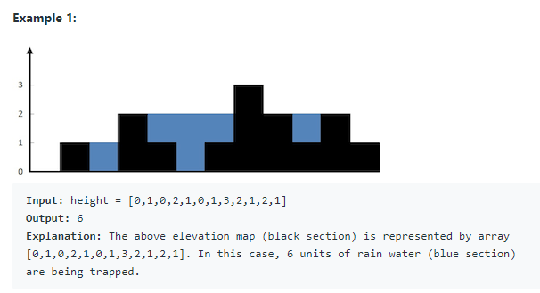
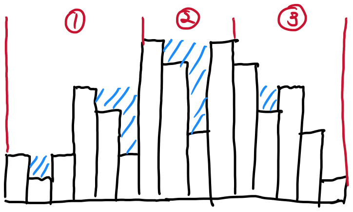

[문제 링크](https://leetcode.com/problems/trapping-rain-water/)

## 42. Trapping Rain Water



그림과 같은 지형에 비가 왔다고 가정했을 때 고여있을 물의 부피를 구하는 문제

### 풀이

지형을 3가지 영역으로 나눠서 볼 수 있다.



~~발그림 ㅈㅅ~~

- 가장 높은 봉우리를 기준으로 영역을 구분한다.
- 1번 영역은 시작부터 가장 높은 봉우리까지이다.
  - 이전 가장 높은 봉우리와 차이만큼 물을 저장할 수 있다.
  - 이전 봉우리보다 높은 봉우리가 나타면 높은 봉우리를 갱신한다.
- 2번 영역은 가장 높은 봉우리가 2개 이상일 때 나타난다.
  - 2번 영역에서는 가장 높은 봉우리와의 차이만큼 물을 저장한다.
- 3번 영역은 1번 영역과 같다.(순서만 다르다.)
- 전체를 순회하며 영역에 따라 계산해주면 된다.

```ts
/**
 * @param {number[]} height
 * @return {number}
 */
var trap = function(height) {
  const max = Math.max(...height)
  const firstIdx = height.indexOf(max)
  const lastIdx = height.lastIndexOf(max)

  let result = 0
  let highest = 0

  const calc = current => {
    if (highest > current) result += highest - current
    else highest = current
  }

  for (let i = 0; i < firstIdx; i++) {
    calc(height[i])
  }

  highest = 0
  for (let i = height.length - 1; i >= lastIdx; i--) {
    calc(height[i])
  }

  for (let i = firstIdx; i < lastIdx; i++) {
    result += max - height[i]
  }

  return result
}
```
