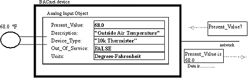

> 본 포스트는 [The Language of BACnet-Objects, Properties and Services](http://www.bacnet.org/Bibliography/ES-7-96/ES-7-96.htm)를 번역한 글입니다.
> 저자의 의도와 다소 다를 수 있습니다.

> 이 글은 [(번역) BACnet - 객체, 속성 및 서비스의 언어(2)](https://www.cckn.dev/protocol/20210504-bacnet-2-services/)로 이어집니다.

## BACnet이란?

BACnet™(Building Automation and Control Network)은 ASHRAE가 개발한 개방형 데이터 통신 프로토콜입니다.

BACnet은 건물 내 또는 다른 제조업체의 시스템 내에서 독점 제어 시스템이 다른 시스템과 통신하지 못하여 야기된 불만을 해소하기 위해 만들어졌습니다.
BACnet은 다른 제조업체의 컴퓨터 기반 제어 장비가 함께 작동하거나 "상호 운용"할 수있는 방법을 제공합니다.

이를 통해 현재와 미래에 대한 모든 크기의 건물 요구에 더 잘 맞도록 장비를 확장, 혼합 및 일치시킬 수 있습니다.

BACnet은 HVAC, 조명, 보안, 화재, 출입 통제, 유지 보수, 폐기물 관리 등 다양한 유형의 건물 제어를 처리하도록 설계되었습니다.

BACnet은 모든 유형의 빌딩 자동화 시스템을 설명하기 위한 정교한 모델을 제공합니다.
이 모델은 시스템이 진정으로 상호 운용 될 수 있으려면 전체 운영의 다양한 측면과 개별 시스템 자체에 대한 합의가 있어야한다는 아이디어를 기반으로 합니다.
장비가 함께 작동하려면 구성 요소가 BACnet 메시지를 교환하고 이해할 수 있어야 합니다.

BACnet은 네 가지 유형의 로컬 영역 네트워크와 네트워킹 프로토콜과 함께 직렬(EIA-232) 인터페이스를 지정하여 한 장치에서 다른 장치로 메시지를 전달합니다.
메시지의 내용 인 BACnet 언어는 BACnet 표준의 주요 부분입니다.

## Objects

BACnet은 객체 지향적인 명명법으로 전통적인 산업 관습에서 출발합니다.
업계는 오랫동안 "포인트"라는 범용 용어를 사용해 왔는데, 이는 제조업체에 따라 특성이 다른 센서 입력, 제어 출력 또는 제어 값을 나타낼 수 있다.
대신 BACnet은 "개체"의 표준 집합을 정의하며, 각 집합은 "속성"의 표준 집합을 가지고 있으며, 오브젝트와 현재 상태를 BACnet 인터넷 상의 다른 장치에 설명합니다.
이러한 속성을 통해 객체가 다른 BACnet 장치에 의해 제어될 수 있습니다.

표준 BACnet 객체 중 하나는 서미스터와 같은 아날로그 센서 입력을 나타내는 아날로그 입력 객체입니다.

**그림 1**은 5가지 속성을 통해 네트워크를 통해 볼 수 있는 아날로그 입력 개체의 다이어그램입니다.

Present_Value 및 Out_Of_Service를 포함한 다른 항목은 Analog Input Object가 나타내는 센서 입력에 대한 상태를 제공합니다.

그러나 다른 것 (아날로그 입력 개체는 최대 25 개의 속성을 가질 수 있음)은 장비 제조업체에서 설정할 수 있고 모두 읽을 수 있습니다.
이 예에서이 아날로그 입력 개체의 Present_Value 속성에 대한 쿼리는 "68.0"응답을받습니다.

**그림 1. An Analog Input Object.**

BACnet은 표 1에 나열된 18 가지 표준 유형의 객체를 정의합니다.이 목록은 포괄적입니다.
전체 건물 제어 시스템의 각 요소는 센서 용 아날로그 입력, 예약 용 일정 또는 경보 배포 용 알림 클래스 등 하나 이상의 개체로 표시됩니다.
BACnet 장치에있는 개체의 선택은 장치의 기능과 성능에 따라 결정됩니다.

BACnet 표준은 모든 BACnet 장치의 모든 개체를 요구하지 않습니다.

VAV 상자를 제어하는 ​​장치에는 여러 아날로그 입력 및 아날로그 출력 개체가있을 수 있지만 센서 입력이나 제어 출력이없는 Windows® 워크 스테이션은 그렇지 않습니다.
모든 BACnet 장치에는 네트워크에 대한 BACnet 장치를 완전히 설명하는 속성 인 장치 개체가 있어야합니다.
예를 들어 장치 개체의 Object_List 속성은 BACnet 장치에 포함 된 모든 개체의 목록을 제공합니다.
Vendor_Name, Vendor_Identifier 및 Model_Name 속성은 장치의 제조업체 이름과 모델을 제공합니다.
또한 BACnet을 통해 제조업체는 다른 제조업체의 장비에서 액세스하거나 이해할 수 없는 독점 개체를 제공 할 수 있습니다.
그러나 표준 BACnet 개체를 방해하지 않습니다.

**표 1. Standard BACnet Objects.**

| OBJECT             | EXAMPLE OF USE                                                                                                                                                                             |     |     |     |
| ------------------ | ------------------------------------------------------------------------------------------------------------------------------------------------------------------------------------------ | --- | --- | --- |
| Analog Input       | Sensor input                                                                                                                                                                               |     |     |     |
| Analog Output      | Control output                                                                                                                                                                             |     |     |     |
| Analog Value       | 설정 값 또는 기타 아날로그 제어 시스템 매개 변수                                                                                                                                           |     |     |     |
| Binary Input       | Switch input                                                                                                                                                                               |     |     |     |
| Binary Output      | Relay output                                                                                                                                                                               |     |     |     |
| Binary Value       | 바이너리 (디지털) 제어 시스템 매개 변수                                                                                                                                                    |     |     |     |
| Calendar           | 예약을 위해 휴일 또는 특별 이벤트와 같은 날짜 목록을 정의합니다.                                                                                                                           |     |     |     |
| Command            | 주간 모드에서 야간 모드로 또는 비상 모드로 특정 목적을 달성하기 위해 여러 장치의 여러 개체에 여러 값을 씁니다.                                                                             |     |     |     |
| Device             | 속성은 장치가 지원하는 개체 및 서비스와 공급 업체, 펌웨어 개정판 등과 같은 기타 장치 별 정보를 알려줍니다.                                                                                 |     |     |     |
| Event Enrollment   | 오류 상태 (예 : "입력 범위를 벗어남") 또는 다른 장치가 알아야 할 알람 일 수있는 이벤트를 설명합니다. 하나의 장치에 직접 알리거나 알림 클래스 개체를 사용하여 여러 장치에 알릴 수 있습니다. |     |     |     |
| File               | 장치에서 지원하는 데이터 파일에 대한 읽기 및 쓰기 액세스를 허용합니다.                                                                                                                     |     |     |     |
| Group              | 단일 읽기 작업에서 여러 개체의 여러 속성에 대한 액세스를 제공합니다.                                                                                                                       |     |     |     |
| Loop               | "제어 루프"에 대한 표준화 된 액세스를 제공합니다.                                                                                                                                          |     |     |     |
| Multi-state Input  | 냉장고의 켜기, 끄기 및 제상주기와 같은 다중 상태 프로세스의 상태를 나타냅니다.                                                                                                             |     |     |     |
| Multi-state Output | 다중 상태 프로세스의 원하는 상태를 나타냅니다 (예 : 냉각 할 시간, 충분히 차가움, 해동 시간).                                                                                               |     |     |     |
| Notification Class | 이벤트 등록 개체가 경고 또는 경보 메시지를 보내야한다고 결정하는 경우 알림을 받을 장치 목록을 포함합니다.                                                                                  |     |     |     |
| Program            | 장치에서 실행중인 프로그램을 시작, 중지, 로드 및 언로드 할 수 있으며 프로그램의 현재 상태를보고합니다.                                                                                     |     |     |     |
| Schedule           | 주별 작업 일정을 정의합니다 (공휴일과 같은 예외가 있는 지정된 개체 목록에 작성하여 수행됨). 예외에 대해 달력 개체를 사용할 수 있습니다.                                                    |     |     |     |

## Properties

BACnet 표준은 123개의 서로 다른 개체 속성을 식별합니다.
이러한 속성의 다른 하위 집합은 각 개체 유형에 대해 지정됩니다.
BACnet 규격을 사용하려면 각 개체에 대해 특정 속성이 있어야 하며 다른 지정된 속성은 선택 사항입니다.
두 경우 모두 구현된 속성은 사양에 의해 정의된 특정 동작을 가지고 있으며, 특히 경보 또는 이벤트 알림과 관련된 동작과 제어 값 또는 상태에 영향을 미칩니다.

BACnet 사양에서 쓰기 가능하려면 표준 속성 중 일부가 필요하며, 다른 속성은 제조업체의 재량에 따라 쓰기 가능해야 합니다. 모두 네트워크를 통해 읽을 수 있습니다.

BACnet에서는 공급업체가 독점 속성을 추가할 수 있지만, 독점 개체와 마찬가지로 독점 속성을 다른 제조업체의 장비에서 이해하거나 액세스할 수 없을 수도 있습니다.

Analog Input Object(아날로그 입력 개체)는 제어 요소와 직접 관련된 개체를 나타내며 대부분의 속성이 이를 반영합니다.

표 2에는 각 속성에 대한 일반 또는 예제 값과 함께 정의된 아날로그 입력 개체의 속성이 나열되어 있습니다.

예를 들어, Status_Flags, Event_State, Reliability, Out_Of_Service, Min_Pres_Value, Max_Pres_Value, Notification_Class, High_Limit, Low_Limit, Limit_Enable, Event_Enable, Acked_Transitions및 Notify_Type 특성은 모두 센서에서 비정상적이고 가능한 위험한 조건을 탐지하고 응답으로 적절한 알림 또는 알람을 생성하는 것을 다룹니다.

**Table 2. 아날로그 입력 개체의 속성.**

| PROPERTY           | BACnet   | EXAMPLE                                                     |
| ------------------ | -------- | ----------------------------------------------------------- |
| Object_Identifier  | Required | Analog Input #1                                             |
| Object_Name        | Required | "AI 01"                                                     |
| Object_Type        | Required | Analog Input                                                |
| Present_Value      | Required | 68.0                                                        |
| Description        | Optional | "Outside Air Temperature"                                   |
| Device_Type        | Optional | "10k Thermistor"                                            |
| Status_Flags       | Required | In_Alarm, Fault, Overridden, Out_Of_Service flags           |
| Event_State        | Required | Normal(및 다양한 문제 보고 상태)                            |
| Reliability        | Optional | No_Fault_Detected(다양한 고장 조건 포함)                    |
| Out_Of_Service     | Required | False                                                       |
| Update_Interval    | Optional | 1.00 (seconds)                                              |
| Units              | Required | Degrees-Fahrenheit                                          |
| Min_Pres_Value     | Optional | -100.0, minimum reliably read value                         |
| Max_Pres_Value     | Optional | +300.0, maximum reliably read value                         |
| Resolution         | Optional | 0.1                                                         |
| COV_Increment      | Optional | Present_Value가 증분별로 변경되는 경우 알림: 0.5            |
| Time_Delay         | Optional | 범위를 벗어나는 것을 감지하기 전에 대기할 시간(초): 5       |
| Notification_Class | Optional | 알림 클래스 개체로 COV 알림 보내기: 2                       |
| High_Limit         | Optional | +215.0, Upper normal range                                  |
| Low_Limit          | Optional | -45.0, Lower normal range                                   |
| Deadband           | Optional | 0.1                                                         |
| Limit_Enable       | Optional | 상한 보고, 하한 보고를 사용합니다.                          |
| Event_Enable       | Optional | To_Offnormal, To_Fault, To_Normal 변경 보고를 활성화합니다. |
| Acked_Transitions  | Optional | 위의 변경 사항에 대해 수신 된 승인을 나타내는 플래그입니다. |
| Notify_Type        | Optional | 이벤트 또는 경보                                            |

나열된 처음 세 개의 속성 (Object_Identifier, Object_Name 및 Object_Type)은 BACnet 장치의 모든 개체에 있어야 합니다.

### Object_Identifier

Object_Identifier는 BACnet 장치 내에서 개체를 고유하게 식별하는 개체 유형 (Object_Type 속성으로도 식별 됨)과 "인스턴스"번호를 식별하는 32 비트 코드입니다.
이론적으로 BACnet 장치에는 특정 유형의 개체가 400 만 개 이상있을 수 있습니다.

### Object_Name

Object_Name은 고유 한 기능을 가진 텍스트 문자열입니다.
BACnet 장치는 특정 Object_Name을 가진 객체를 포함하는 장치에 대한 쿼리를 브로드 캐스트 할 수 있습니다.
이것은 프로젝트 설정을 크게 단순화 할 수 있습니다.

BACnet은 모든 BACnet 장치에 하나의 장치 개체가 있어야합니다.

장치 개체는 장치 및 해당 기능에 대한 정보를 네트워크의 다른 장치에서 사용할 수 있도록합니다.

한 BACnet 장치가 다른 장치와의 관련 통신을 제어하기 전에 다른 장치의 장치 개체가 제공하는 정보 중 일부를 얻어야합니다.

표 3은 BACnet Dual-Duct VAV 컨트롤러 용 장치 개체의 예를 보여줍니다.

속성 목록이 인상적이지만 대부분은 제조업체에서 수정하고 다른 BACnet 장치에서만 읽을 수 있습니다.

다른 개체와 달리 장치 개체의 인스턴스 번호는 BACnet 장치를 고유하게 식별하는 데 사용되기 때문에 전체 BACnet 인터 네트워크에서 고유해야합니다.

설치 중에 다른 장치에서 BACnet 장치를 편리하게 식별하는 데 사용할 수 있습니다.

**표 3. 장치 개체의 속성.**

| PROPERTY                        | BACnet   | EXAMPLE                                          |
| ------------------------------- | -------- | ------------------------------------------------ |
| Object_Identifier               | Required | Device #1076                                     |
| Object_Name                     | Required | "Office 36 DD Control"                           |
| Object_Type                     | Required | Device                                           |
| System_Status                   | Required | Operational (plus others)                        |
| Vendor_Name                     | Required | "Alerton Technologies, Inc."                     |
| Vendor_Identifier               | Required | Alerton                                          |
| Model_Name                      | Required | "VAV-DD Controller"                              |
| Firmware_Revision               | Required | "1.0"                                            |
| Application_Software_Version    | Required | "Dual-Duct DDC"                                  |
| Location                        | Optional | "Office 36, Floor 3"                             |
| Description                     | Optional | "(on network 5)"                                 |
| Protocol_Version                | Required | 1 (BACnet protocol version)                      |
| Protocol_Conformance_Class      | Required | 2                                                |
| Protocol_Services_Supported     | Required | readProperty, writeProperty, atomicWriteFile,... |
| Protocol_Object_Types_Supported | Required | Analog Input, Analog Output,...                  |
| Object_List                     | Required | Analog Input #1, Analog Input #2, ...            |
| Max_APDU_Length_Supported       | Required | 50 (bytes or characters)                         |
| Segmentation_Supported          | Required | No                                               |
| VT_Classes_Supported            | Optional | n/a                                              |
| Active_VT_Sessions              | Optional | n/a                                              |
| Local_Time                      | Optional | 12:30:15.22                                      |
| Local_Date                      | Optional | Tuesday, March 12, 1996                          |
| UTC_Offset                      | Optional | +480 (minutes from GMT/UTM)                      |
| Daylight_Savings_Status         | Optional | False (not in effect)                            |
| APDU_Segment_Timeout            | Optional | n/a                                              |
| APDU_Timeout                    | Required | 3000 milliseconds                                |
| Number_Of_APDU_Retries          | Required | 0                                                |
| List_Of_Session_Keys            | Optional | n/a                                              |
| Time_Synchronization_Recipients | Optional | n/a                                              |
| Max_Master                      | Optional | n/a                                              |
| Max_Info_Frames                 | Optional | n/a                                              |
| Device_Address_Binding          | Required | None                                             |
