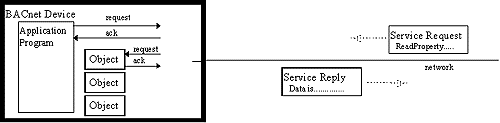

> 본 포스트는 [The Language of BACnet-Objects, Properties and Services](http://www.bacnet.org/Bibliography/ES-7-96/ES-7-96.htm)를 번역한 글입니다.
> 저자의 의도와 다소 다를 수 있습니다.

> 이 글은 [(번역) BACnet - 객체, 속성 및 서비스의 언어(1)](https://www.cckn.dev/protocol/20210504-bacnet-1-overview%20and%20properties/)에서 이어집니다.

## Services

서비스는 하나의 BACnet 장치가 다른 장치에서 정보를 얻거나, 다른 장치에 일부 작업을 수행하도록 명령하거나, 일부 이벤트가 발생한 하나 이상의 장치에 알리는 수단입니다. 발급된 각 서비스 요청과 반환된 서비스 확인(응답)은 송신에서 수신 장치로 전송되는 메시지 패킷이 됩니다.

BACnet 장치에서 실행되는 "응용 프로그램"은 서비스 요청을 발행하여 수신 즉시 처리합니다. 응용 프로그램은 장치의 작동을 수행하는 실제 소프트웨어입니다. 운영자 워크스테이션의 경우, 소프트웨어는 운영자에 대한 여러 센서 입력의 표시를 유지할 수 있으며, 입력의 최신 값을 얻기 위해 대상 장치의 해당 객체에 대한 서비스 요청을 주기적으로 발행합니다. 모니터링되는 디바이스에서 해당 애플리케이션 프로그램에서 서비스 요청이 처리되고 요청된 데이터가 포함된 응답이 반환됩니다. 이는 그림 2에 나타나 있습니다.

**그림 2. 서비스 요청 및 응답.**

BACnet은 32개의 서비스를 정의하고 5개의 범주로 분류합니다. 이러한 서비스 범주는 경보 및 이벤트, 파일 액세스, 개체 액세스, 원격 디바이스 관리 및 가상 터미널 서비스입니다. 다음 표에 "C"라는 레이블이 붙은 "Confirmed" 서비스(일반적으로 데이터가 포함된 응답 예상됨) 각각에 대해 BACnet 장치는 서비스 요청을 시작할 수 있는 기능 또는 해당 유형의 수신된 요청을 처리하고 응답할 수 있는 기능 또는 둘 다 가질 수 있습니다. 다음 표에 "U"라는 레이블이 붙은 "확인되지 않은"(답장이 예상되지 않음) 서비스 각각에 대해 BACnet 장치는 서비스 요청을 시작할 수 있는 기능 또는 해당 유형의 수신된 요청을 처리할 수 있는 기능 또는 둘 모두를 가질 수 있습니다.

BACnet 장치가 모든 서비스를 구현할 필요는 없습니다. 모든 BACnet 장치에서 하나의 서비스, Read Property만 처리하면 됩니다. 장치의 기능과 복잡성에 따라 추가 서비스를 시작하거나 실행할 수 있습니다.

Alarm and Event Services는 BACnet 장치에서 알람을 포함한 상태 변화를 처리합니다. 센서 판독값이 정상 범위를 벗어났거나 정상 작동으로 돌아가는("이벤트") 문제 또는 오류 조건을 나타낼 수 있는 경보 및 이벤트 변경 또는 "Change Of Value" 또는 COV라는 이전 보고서 이후 일부 증가분의 판독값 변경입니다.

COV 보고는 모니터링되는 일부 값에 대해 개체를 반복적으로 폴링하는 데 유용한 대안입니다. 모니터링되는 개체가 포함된 장치는 다른 많은 장치에서 모니터링 중인 경우 네트워크 트래픽 정체를 겪을 수 있습니다. COV 보고 기능을 사용하면 변경 사항이 발생할 때 알림을 보낼 수 있습니다.

경보, 이벤트 및 COV 통지는 애플리케이션 프로그램 모니터링 개체(특히 다양한 입력, 출력 및 값 개체)가 제어 작업과 직접 관련된 개체와 루프 개체에 의해 생성됩니다.

**표 4. 경보 및 이벤트 서비스.**

| SERVICE                    | BACnet | DESCRIPTION                                                       |
| -------------------------- | ------ | ----------------------------------------------------------------- |
| AcknowledgeAlarm           | C      | 사람이 경보를 본 것을 경보 발신자에게 알리는 데 사용됩니다.       |
| ConfirmedCOVNotification   | C      | 속성에서 발생한 COV의 구독 장치를 알려줍니다.                     |
| ConfirmedEventNotification | C      | 발신인에게 가능한 오류 조건을 알려주는 데 사용됩니다.             |
| GetAlarmSummary            | C      | 활성 경보(있는 경우) 목록을 장치에서 요청합니다.                  |
| GenEnrollmentSummary       | C      | 개체를 생성하는 "이벤트"(오류 발생 가능) 목록을 요청합니다.       |
| SubscribeCOV               | C      | 개체의 COV에 대해 알려주도록 요청하기 위해 장치에서 전송합니다.   |
| UnconfirmedCOVNotification | U      | 특정 개체의 하나 이상의 속성이 변경되었음을 구독 장치에 알립니다. |

서비스 이름에서 "원자"라는 단어는 한 번에 하나의 읽기 또는 쓰기 작업만 수행할 수 있음을 의미합니다. 액세스 중에 파일에 액세스하려는 다른 시도는 실패하거나 보류됩니다.

현재 표준 BACnet 정의 파일은 없으며, 정의상 모든 파일 액세스는 벤더 소유이며, BACnet은 나중에 정의될 파일 구조를 위해 EVENTLOG 및 VALUELOG 파일 형식을 예약했습니다.

**표 5. 파일 액세스 서비스.**

| SERVICE         | BACnet | DESCRIPTION                                       |
| --------------- | ------ | ------------------------------------------------- |
| AtomicReadFile  | C      | 파일 오브젝트 파일의 일부 또는 전체를 요청합니다. |
| AtomicWriteFile | C      | 파일 오브젝트 파일의 일부 또는 전체에 씁니다.     |

개체 액세스 서비스는 속성을 읽기, 수정 및 쓰고 개체를 추가 및 삭제할 수 있는 수단을 제공합니다. 다중 서비스는 읽기 및 쓰기 속성을 위해 제공됩니다. 보다 복잡한 서비스(ReadPropertyMultiple 및 WritePropertyMultiple)의 목적은 BACnet 장치 내의 개체 속성에 대한 읽기 또는 쓰기를 단일 메시지로 결합하여 네트워크 오버헤드를 줄이는 것입니다. ReadPropertyConditional Service는 한 단계 더 나아갑니다. 요청을 처리하는 장치는 요청에 포함된 기준에 따라 참조된 각 속성을 테스트하고 조건이 충족된 경우에만 값을 반환합니다.

CreateObject 및 DeleteObject Services가 정의되어 있지만 제한된 개체 집합에 적용됩니다. 예를 들어 일부 물리적 디바이스에 연결된 개체는 생성 가능하거나 삭제할 수 없습니다. 그룹 및 이벤트 등록 개체, 파일 개체는 CreateObject 및 DeleteObject Services의 일반적인 제목일 수 있습니다.

**표 6. 개체 액세스 서비스.**

| SERVICE                 | BACnet | DESCRIPTION                                                  |
| ----------------------- | ------ | ------------------------------------------------------------ |
| AddListElement          | C      | 목록인 속성에 하나 이상의 항목을 추가합니다.                 |
| RemoveListElement       | C      | 목록 속성에서 하나 이상의 항목을 제거합니다.                 |
| CreateObject            | C      | 서빙 디바이스에서 개체의 새 인스턴스를 만드는 데 사용됩니다. |
| DeleteObject            | C      | 서빙 디바이스의 특정 개체를 삭제하는 데 사용됩니다.          |
| ReadProperty            | C      | 한 개체의 속성 값을 반환합니다.                              |
| ReadPropertyConditional | C      | 여러 개체에 있는 여러 속성의 값을 반환합니다.                |
| ReadPropertyMultiple    | C      | 다중 객체의 다중 속성 값을 반환합니다.                       |
| WriteProperty           | C      | 하나의 객체의 하나의 속성에 값을 씁니다.                     |
| WritePropertyMultiple   | C      | 여러 개체의 여러 속성에 값을 씁니다.                         |

표 7에 나열된 Remote Device Management Services는 운영자 제어, 전문 메시지 전송, 주소 지정/자동 구성 기능 등 다양한 기능을 제공합니다.

장치 통신 제어 및 다시 초기화합니다.장치 서비스는 원격으로 호출될 수 있는 진단 도구를 인간 운영자에게 제공하기 위한 것입니다. BACnet 장치는 장치 통신 제어 및 다시 초기화를 제외한 모든 BACnet 메시지를 무시하도록 주문할 수 있습니다.장치 서비스) 또는 웜 스타트 또는 콜드 스타트입니다.

ConfirmedPrivate Transfer 및 UnconfirmedPrivate Transfer Services는 BACnet 표준 이외의 메시지를 전달하는 데 사용되어 비표준 서비스를 효과적으로 호출합니다. 이 서비스에는 표준 BACnet 형식의 공급업체 ID 코드와 서비스 코드가 모두 포함되어 있습니다. 나머지 콘텐츠는 전적으로 공급업체의 몫이며 다른 제조업체의 장치에서 해석할 수 없을 가능성이 높습니다.

확인 텍스트 메시지 및 확인되지 않은 텍스트 메시지 서비스는 프린터와 같은 다른 장치로 텍스트 메시지를 전송합니다.

Time Synchronization Service는 다른 장치에 클럭이 있는 지정된 장치에 의해 전송되거나 장치가 동기화될 수 있도록 브로드캐스트됩니다.

Who-Is 및 I-Am 서비스는 BACnet 네트워크에서 BACnet 장치의 네트워크 주소를 가져오는 데 사용됩니다. 이러한 서비스는 각 BACnet 장치에 다른 장치의 네트워크 주소를 프로그래밍할 필요성을 줄이거나 제거할 수 있으므로 설치 관리자의 업무가 훨씬 쉬워집니다. 대신 하나 이상의 장치의 주소를 알아야 하는 BACnet 장치는 장치 개체 인스턴스 번호 또는 인스턴스 번호 범위를 지정하는 Who-Is Service 요청(메시지)을 인터네트워크에서 브로드캐스트할 수 있습니다. 응답은 회신으로 반환되지 않습니다. 대신 지정된 장치 개체가 있는 장치는 로컬 네트워크, 원격 네트워크 또는 전체 인터네트워크에서 I-Am 서비스 요청을 브로드캐스트하여 요청 장치가 응답을 보고 응답자의 주소 정보를 전달합니다. 이렇게 하면 응답자에 대해 알아야 할 다른 장치가 더 많은 네트워크 트래픽을 만들지 않고도 주소 정보를 얻을 수 있습니다.

Who-Has 및 I-Have 서비스는 Who-Is 및 I-Am과 유사하지만 Who-Has는 개체 식별자(개체 유형 + 인스턴스 번호, 각 장치 내에서 고유) 또는 개체 이름(각 장치 내에서 고유한 모든 개체의 속성)을 추가합니다. 요청과 일치하는 개체가 포함된 수신 장치는 I-Have Service 요청을 브로드캐스트합니다.

**표 7. 원격 장치 관리 서비스.**

| SERVICE                    | BACnet | DESCRIPTION                                                     |
| -------------------------- | ------ | --------------------------------------------------------------- |
| DeviceCommunicationControl | C      | 네트워크 메시지 수신을 중지 (및 시작!)하도록 장치에 지시합니다. |
| ConfirmedPrivateTransfer   | C      | 공급 업체 독점 메시지를 장치에 보냅니다.                        |
| UnconfirmedPrivateTransfer | U      | 공급 업체 독점 메시지를 하나 이상의 장치에 보냅니다.            |
| ReinitializeDevice         | C      | 수신 장치에 자체 콜드 또는 웜 부팅을 주문합니다.                |
| ConfirmedTextMessage       | C      | 다른 장치로 문자 메시지를 전달합니다.                           |
| UnconfirmedTextMessage     | U      | 하나 이상의 장치에 문자 메시지를 보냅니다.                      |
| TimeSynchronization        | U      | 현재 시간을 하나 이상의 장치로 보냅니다.                        |
| Who-Has                    | U      | 특정 개체를 포함하는 BACnet 장치를 묻습니다.                    |
| I-Have                     | U      | Who-Has에 대한 긍정적인 응답, broadcast.                        |
| Who-Is                     | U      | 지정된 BACnet 장치의 존재 여부를 묻습니다.                      |
| I-Am                       | U      | Who-Is에 대한 긍정적인 응답, broadcast.                         |

운영자는 VT(Virtual Terminal) 서비스를 사용하여 원격 디바이스에서 실행되는 애플리케이션 프로그램과 양방향 텍스트 기반 연결을 설정할 수 있습니다. 실제로 원격 디바이스로 설정된 VT 세션 기간 동안 운영자의 디바이스는 원격 애플리케이션 프로그램에 연결된 터미널처럼 보입니다.

**표 8. 가상 터미널 서비스.**

| SERVICE  | BACnet | DESCRIPTION                                                        |
| -------- | ------ | ------------------------------------------------------------------ |
| VT-Open  | C      | 원격 BACnet 디바이스와의 가상 터미널 세션을 설정합니다.            |
| VT-Close | C      | 설정된 가상 터미널 세션을 닫습니다.                                |
| VT-Data  | C      | 한 디바이스에서 세션에 참여하는 다른 디바이스로 텍스트를 보냅니다. |
