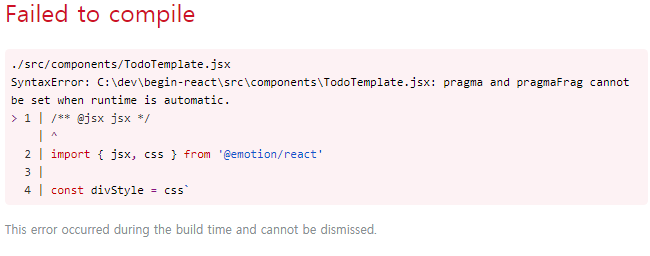
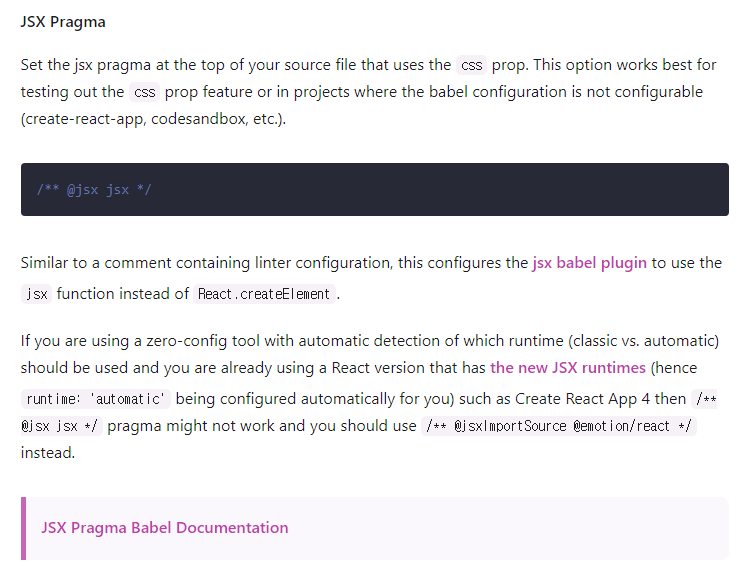

> React 프로젝트에 EmotionJS 설치 중 겪은 에러와 해결방법을 공유한다.

emotion을 사용하면 파일 최상단에 `/** @jsx jsx */` 라는 주석을 추가해주어야 하는데



```js
./src/components/TodoTemplate.jsx
SyntaxError: C:\dev\begin-react\src\components\TodoTemplate.jsx: pragma and pragmaFrag cannot be set when runtime is automatic.
> 1 | /** @jsx jsx */
    | ^
  2 | import { jsx, css } from '@emotion/react'
  3 |
  4 | const divStyle = css`
```

최신 cra로 생성한 프로젝트의 경우 위와 같은 에러를 뱉으며 문제가 발생한다.

그렇다고 저 주석을 삭제하면 Emotion이 정상동작하지 않는 상황

## 해결 방법

공식 홈페이지의 문서를 참조해보면 `/** @jsx jsx */*`가 동작하지 않는 경우 _`/_@jsxImportSource @emotion/react \*/` 를 대신 사용하라고 한다.



```jsx
/** @jsxImportSource @emotion/react */

import { jsx, css } from '@emotion/react'
```

최상단의 주석을 `/** @jsxImportSource @emotion/react */` 로 바꿔주면 잘 동작한다. 😀

## 참조

[https://emotion.sh/docs/css-prop#jsx-pragma](https://emotion.sh/docs/css-prop#jsx-pragma)
