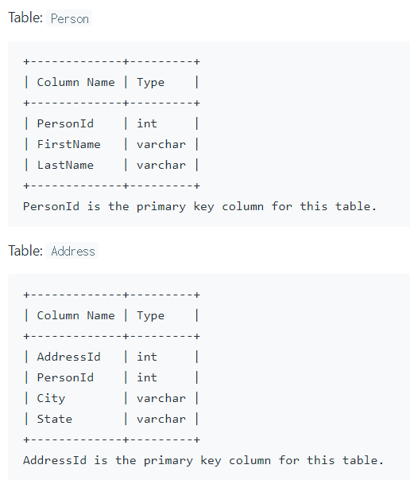
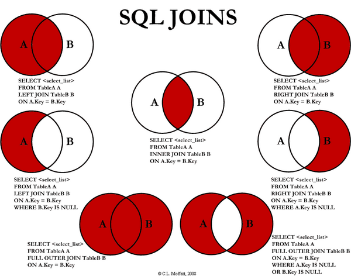

[175. Combine Two Tables](https://leetcode.com/problems/combine-two-tables/)

## 문제 설명



> Write a SQL query for a report that provides the following information for each person in the Person table, regardless if there is an address for each of those people: FirstName, LastName, City, State

> 주소에 대한 정보의 유무와 상관 없이 각 사람의 정보를 출력하는 쿼리를 작성하라. 담아야 하는 정보는 FirstName, LastName, City, State이다.

## 풀이

Join을 이용해 두 테이블을 합쳐야 하는데 주소가 없는 사람의 경우에도 출력해야 한다.



위 그림 중 가장 좌상단에 있는 LEFT OUTER JOIN을 이용하자.

```sql
SELECT FirstName, LastName, City, State
FROM Person
    LEFT JOIN Address
    on Person.PersonId = Address.PersonId
```
