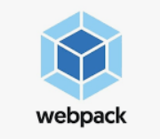

## Cross-env 사용 이유

`Webpack` 사용 도중 `process.env.NODE_ENV`가 `development`인지 `production`인지에 따라 `Webpack` 설정을 바꾸려고 하고 있었다.

잘 안되서 살펴보니 `process.env.NODE_ENV === undefined`로 나오고 있었다.

구글링으로 해결하고 방법을 기술한다.

> `cmd`를 이용한 여러가지 해결책이 나왔지만 `cross-env`를 사용하면 macOS나 linux에서도 동일하게 사용할 수 있어 `cross-env`를 택했다.

## cross-env를 이용한 NODE_ENV 주입

[cross-env](https://www.npmjs.com/package/cross-env)는 운영체제나 플랫폼에 종속되지 않고 동일한 방법으로 `env` 변수를 주입하는 방법이다.

`cross-env`를 사용해보자

### 설치

```bash
npm install --save-dev cross-env
```

### 사용

```json
{
  "scripts": {
    ...
    "build": "cross-env NODE_ENV=production webpack --config build/webpack.config.js"
    ...
  }
}
```

사용법은 아주 간단하다. 사용할 커맨드 앞에 `cross-env [<key>=<value>, ...]`를 붙여 실행해주면 된다.

예를 들어 `NODE_ENV`를 `development`로 하고 `webpack`을 돌리고 싶으면

```bash
cross-env NODE_ENV=development webpack
```

과 같이 하면 된다.

### npm script 등록

`terminal`에서 바로 위와 같이 하려면 `cross-env`가 `global`로 설치되어 있어야 한다.
편하게 사용하려면 `npm script`로 등록하자

```json
// package.json
  ...
  "scripts": {
    ...
    "build": "cross-env NODE_ENV=production webpack --config build/webpack.config.js"
    ...
  }
}
```

개인적으로는 이렇게 사용한다.

```json
{
  "scripts": {
    "build": "cross-env NODE_ENV=development webpack --progress",
    "build:production": "cross-env NODE_ENV=production webpack --progress"
  }
}
```

```bash
#development로 돌리려면
npm run build

#production로 돌리려면
npm run build:production
```

## 참조

- https://stackoverflow.com/questions/9249830/how-can-i-set-node-env-production-on-windows
- https://www.npmjs.com/package/cross-env
